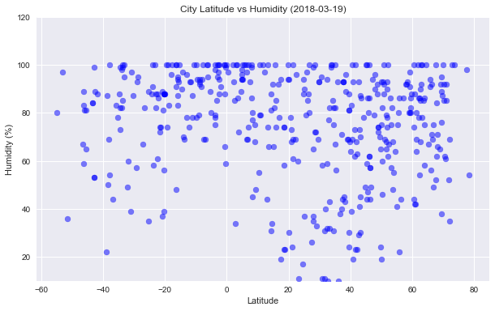
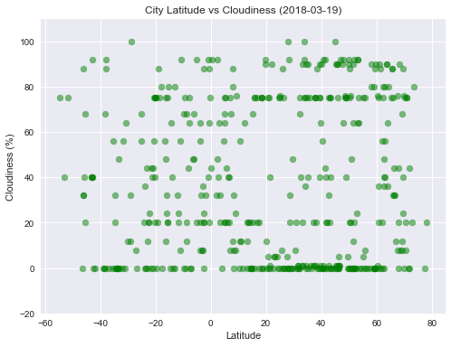
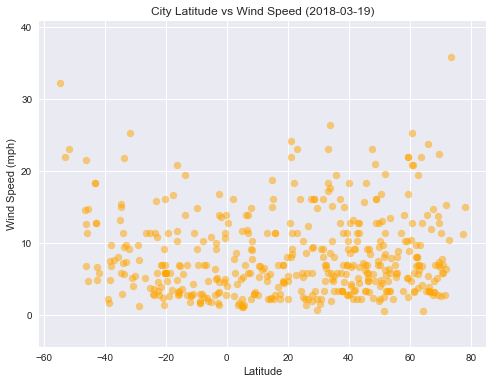

```python

import random
import pandas as pd
import time 
import seaborn as sns
import matplotlib.pyplot as plt
import numpy as np
from datetime import datetime
```


```python
import openweathermapy as owm
```


```python
from citipy import citipy
cities = []


while len(cities)<500:
    x = (random.choice(range(-90,90)))
    y = (random.choice(range(-180,180)))
    city = citipy.nearest_city(x,y).city_name
    if city not in cities:
        cities.append(city)

```


```python
len(cities)
```


    500


*-90 to + 90 -- latitudes
*-180 to +180 -- longitudes


```python
from config import api_key
# Create settings dictionary with information we're interested in
settings = {"units": "imperial", "appid": api_key}
```


```python
WeatherPy_df =pd.DataFrame(columns = ["City","Cloudiness", "Country",
                                    "Date", "Max Temp", "Wind Speed", 
                                    "Lat","Lng", "Humidity"])
```


```python
count = 1
err = 0
sets = 0
index = 0
#Get current weather
t0 =time.time()
print(f'Beginning Data Retrieval \n ........................')
for city in cities:
    try:
        city_stats = owm.get_current(city, **settings)
        city = city.replace(" ", "")
        print(f'Processing Record {count} of Set {sets} | {city}' )
        print(f'{owm.BASE_URL}weather?q={city}&units=imperial&APPID={api_key}')
        WeatherPy_df.set_value(index, "City", city_stats["name"])
        WeatherPy_df.set_value(index, "Cloudiness", city_stats("clouds.all"))
        WeatherPy_df.set_value(index, "Country", city_stats("sys.country"))
        WeatherPy_df.set_value(index, "Date", city_stats("dt"))
        WeatherPy_df.set_value(index, "Max Temp", city_stats("main.temp_max"))
        WeatherPy_df.set_value(index, "Wind Speed", city_stats("wind.speed"))
        WeatherPy_df.set_value(index, "Lat", city_stats("coord.lat"))
        WeatherPy_df.set_value(index, "Lng", city_stats("coord.lon"))
        WeatherPy_df.set_value(index, "Humidity", city_stats("main.humidity"))
        index = index +1 
    except Exception as e:
        print(e)
        err= err+1
    count = count+1
    if count == 50:
        t1=time.time()
        count = 1 
        sets = sets+1
        time.sleep(70-(t1-t0))
        t0=time.time()

print("end of stats loop")
print(f'Could not get data for {err} cities')
WeatherPy_df
```

    Beginning Data Retrieval 
     ........................
    Processing Record 1 of Set 0 | mataura
    http://api.openweathermap.org/data/2.5/weather?q=mataura&units=imperial&APPID=550c1a2896ccc20ae6bf4af57366fea4
    Processing Record 2 of Set 0 | tanabe
    http://api.openweathermap.org/data/2.5/weather?q=tanabe&units=imperial&APPID=550c1a2896ccc20ae6bf4af57366fea4
    Processing Record 3 of Set 0 | provideniya
    http://api.openweathermap.org/data/2.5/weather?q=provideniya&units=imperial&APPID=550c1a2896ccc20ae6bf4af57366fea4
    Processing Record 4 of Set 0 | barrow
    http://api.openweathermap.org/data/2.5/weather?q=barrow&units=imperial&APPID=550c1a2896ccc20ae6bf4af57366fea4
    Processing Record 5 of Set 0 | sanquintin
    http://api.openweathermap.org/data/2.5/weather?q=sanquintin&units=imperial&APPID=550c1a2896ccc20ae6bf4af57366fea4
    Processing Record 6 of Set 0 | butaritari
    http://api.openweathermap.org/data/2.5/weather?q=butaritari&units=imperial&APPID=550c1a2896ccc20ae6bf4af57366fea4
    Processing Record 7 of Set 0 | busselton
    http://api.openweathermap.org/data/2.5/weather?q=busselton&units=imperial&APPID=550c1a2896ccc20ae6bf4af57366fea4
    HTTP Error 404: Not Found
    Processing Record 9 of Set 0 | riogrande
    http://api.openweathermap.org/data/2.5/weather?q=riogrande&units=imperial&APPID=550c1a2896ccc20ae6bf4af57366fea4
    Processing Record 10 of Set 0 | hilo
    http://api.openweathermap.org/data/2.5/weather?q=hilo&units=imperial&APPID=550c1a2896ccc20ae6bf4af57366fea4
    Processing Record 11 of Set 0 | atuona
    http://api.openweathermap.org/data/2.5/weather?q=atuona&units=imperial&APPID=550c1a2896ccc20ae6bf4af57366fea4
    Processing Record 12 of Set 0 | roald
    http://api.openweathermap.org/data/2.5/weather?q=roald&units=imperial&APPID=550c1a2896ccc20ae6bf4af57366fea4
    Processing Record 13 of Set 0 | kapaa
    http://api.openweathermap.org/data/2.5/weather?q=kapaa&units=imperial&APPID=550c1a2896ccc20ae6bf4af57366fea4
    Processing Record 14 of Set 0 | paka
    http://api.openweathermap.org/data/2.5/weather?q=paka&units=imperial&APPID=550c1a2896ccc20ae6bf4af57366fea4
    Processing Record 15 of Set 0 | jamestown
    http://api.openweathermap.org/data/2.5/weather?q=jamestown&units=imperial&APPID=550c1a2896ccc20ae6bf4af57366fea4
    Processing Record 16 of Set 0 | normanwells
    http://api.openweathermap.org/data/2.5/weather?q=normanwells&units=imperial&APPID=550c1a2896ccc20ae6bf4af57366fea4
    Processing Record 17 of Set 0 | ribeiragrande
    http://api.openweathermap.org/data/2.5/weather?q=ribeiragrande&units=imperial&APPID=550c1a2896ccc20ae6bf4af57366fea4
    Processing Record 18 of Set 0 | mardelplata
    http://api.openweathermap.org/data/2.5/weather?q=mardelplata&units=imperial&APPID=550c1a2896ccc20ae6bf4af57366fea4
    Processing Record 19 of Set 0 | rikitea
    http://api.openweathermap.org/data/2.5/weather?q=rikitea&units=imperial&APPID=550c1a2896ccc20ae6bf4af57366fea4
    Processing Record 20 of Set 0 | ushuaia
    http://api.openweathermap.org/data/2.5/weather?q=ushuaia&units=imperial&APPID=550c1a2896ccc20ae6bf4af57366fea4
    Processing Record 21 of Set 0 | yellowknife
    http://api.openweathermap.org/data/2.5/weather?q=yellowknife&units=imperial&APPID=550c1a2896ccc20ae6bf4af57366fea4
    Processing Record 22 of Set 0 | flinders
    http://api.openweathermap.org/data/2.5/weather?q=flinders&units=imperial&APPID=550c1a2896ccc20ae6bf4af57366fea4
    Processing Record 23 of Set 0 | vaini
    http://api.openweathermap.org/data/2.5/weather?q=vaini&units=imperial&APPID=550c1a2896ccc20ae6bf4af57366fea4
    Processing Record 24 of Set 0 | qaanaaq
    http://api.openweathermap.org/data/2.5/weather?q=qaanaaq&units=imperial&APPID=550c1a2896ccc20ae6bf4af57366fea4
    Processing Record 25 of Set 0 | vilafrancadocampo
    http://api.openweathermap.org/data/2.5/weather?q=vilafrancadocampo&units=imperial&APPID=550c1a2896ccc20ae6bf4af57366fea4
    HTTP Error 404: Not Found
    Processing Record 27 of Set 0 | sanvicente
    http://api.openweathermap.org/data/2.5/weather?q=sanvicente&units=imperial&APPID=550c1a2896ccc20ae6bf4af57366fea4
    Processing Record 28 of Set 0 | jatiroto
    http://api.openweathermap.org/data/2.5/weather?q=jatiroto&units=imperial&APPID=550c1a2896ccc20ae6bf4af57366fea4
    Processing Record 29 of Set 0 | castro
    http://api.openweathermap.org/data/2.5/weather?q=castro&units=imperial&APPID=550c1a2896ccc20ae6bf4af57366fea4
    Processing Record 30 of Set 0 | havoysund
    http://api.openweathermap.org/data/2.5/weather?q=havoysund&units=imperial&APPID=550c1a2896ccc20ae6bf4af57366fea4
    Processing Record 31 of Set 0 | sanandres
    http://api.openweathermap.org/data/2.5/weather?q=sanandres&units=imperial&APPID=550c1a2896ccc20ae6bf4af57366fea4
    Processing Record 32 of Set 0 | bria
    http://api.openweathermap.org/data/2.5/weather?q=bria&units=imperial&APPID=550c1a2896ccc20ae6bf4af57366fea4
    Processing Record 33 of Set 0 | sanjoaquin
    http://api.openweathermap.org/data/2.5/weather?q=sanjoaquin&units=imperial&APPID=550c1a2896ccc20ae6bf4af57366fea4
    HTTP Error 404: Not Found
    Processing Record 35 of Set 0 | tasiilaq
    http://api.openweathermap.org/data/2.5/weather?q=tasiilaq&units=imperial&APPID=550c1a2896ccc20ae6bf4af57366fea4
    Processing Record 36 of Set 0 | vao
    http://api.openweathermap.org/data/2.5/weather?q=vao&units=imperial&APPID=550c1a2896ccc20ae6bf4af57366fea4
    Processing Record 37 of Set 0 | evensk
    http://api.openweathermap.org/data/2.5/weather?q=evensk&units=imperial&APPID=550c1a2896ccc20ae6bf4af57366fea4
    Processing Record 38 of Set 0 | avarua
    http://api.openweathermap.org/data/2.5/weather?q=avarua&units=imperial&APPID=550c1a2896ccc20ae6bf4af57366fea4
    Processing Record 39 of Set 0 | tiksi
    http://api.openweathermap.org/data/2.5/weather?q=tiksi&units=imperial&APPID=550c1a2896ccc20ae6bf4af57366fea4
    Processing Record 40 of Set 0 | jabinyanah
    http://api.openweathermap.org/data/2.5/weather?q=jabinyanah&units=imperial&APPID=550c1a2896ccc20ae6bf4af57366fea4
    Processing Record 41 of Set 0 | kahului
    http://api.openweathermap.org/data/2.5/weather?q=kahului&units=imperial&APPID=550c1a2896ccc20ae6bf4af57366fea4
    Processing Record 42 of Set 0 | albany
    http://api.openweathermap.org/data/2.5/weather?q=albany&units=imperial&APPID=550c1a2896ccc20ae6bf4af57366fea4
    Processing Record 43 of Set 0 | capetown
    http://api.openweathermap.org/data/2.5/weather?q=capetown&units=imperial&APPID=550c1a2896ccc20ae6bf4af57366fea4
    Processing Record 44 of Set 0 | longyearbyen
    http://api.openweathermap.org/data/2.5/weather?q=longyearbyen&units=imperial&APPID=550c1a2896ccc20ae6bf4af57366fea4
    HTTP Error 404: Not Found
    Processing Record 46 of Set 0 | anchorage
    http://api.openweathermap.org/data/2.5/weather?q=anchorage&units=imperial&APPID=550c1a2896ccc20ae6bf4af57366fea4
    Processing Record 47 of Set 0 | lasa
    http://api.openweathermap.org/data/2.5/weather?q=lasa&units=imperial&APPID=550c1a2896ccc20ae6bf4af57366fea4
    Processing Record 48 of Set 0 | saint-denis
    http://api.openweathermap.org/data/2.5/weather?q=saint-denis&units=imperial&APPID=550c1a2896ccc20ae6bf4af57366fea4
    HTTP Error 404: Not Found
    Processing Record 1 of Set 1 | jaciara
    http://api.openweathermap.org/data/2.5/weather?q=jaciara&units=imperial&APPID=550c1a2896ccc20ae6bf4af57366fea4
    Processing Record 2 of Set 1 | puntaarenas
    http://api.openweathermap.org/data/2.5/weather?q=puntaarenas&units=imperial&APPID=550c1a2896ccc20ae6bf4af57366fea4
    Processing Record 3 of Set 1 | bocadoacre
    http://api.openweathermap.org/data/2.5/weather?q=bocadoacre&units=imperial&APPID=550c1a2896ccc20ae6bf4af57366fea4
    Processing Record 4 of Set 1 | vitim
    http://api.openweathermap.org/data/2.5/weather?q=vitim&units=imperial&APPID=550c1a2896ccc20ae6bf4af57366fea4
    Processing Record 5 of Set 1 | ahipara
    http://api.openweathermap.org/data/2.5/weather?q=ahipara&units=imperial&APPID=550c1a2896ccc20ae6bf4af57366fea4
    Processing Record 6 of Set 1 | rawson
    http://api.openweathermap.org/data/2.5/weather?q=rawson&units=imperial&APPID=550c1a2896ccc20ae6bf4af57366fea4
    Processing Record 7 of Set 1 | mahebourg
    http://api.openweathermap.org/data/2.5/weather?q=mahebourg&units=imperial&APPID=550c1a2896ccc20ae6bf4af57366fea4
    Processing Record 8 of Set 1 | urubicha
    http://api.openweathermap.org/data/2.5/weather?q=urubicha&units=imperial&APPID=550c1a2896ccc20ae6bf4af57366fea4
    HTTP Error 404: Not Found
    Processing Record 10 of Set 1 | beloha
    http://api.openweathermap.org/data/2.5/weather?q=beloha&units=imperial&APPID=550c1a2896ccc20ae6bf4af57366fea4
    Processing Record 11 of Set 1 | hermanus
    http://api.openweathermap.org/data/2.5/weather?q=hermanus&units=imperial&APPID=550c1a2896ccc20ae6bf4af57366fea4
    Processing Record 12 of Set 1 | verkhoyansk
    http://api.openweathermap.org/data/2.5/weather?q=verkhoyansk&units=imperial&APPID=550c1a2896ccc20ae6bf4af57366fea4
    Processing Record 13 of Set 1 | sola
    http://api.openweathermap.org/data/2.5/weather?q=sola&units=imperial&APPID=550c1a2896ccc20ae6bf4af57366fea4
    Processing Record 14 of Set 1 | astoria
    http://api.openweathermap.org/data/2.5/weather?q=astoria&units=imperial&APPID=550c1a2896ccc20ae6bf4af57366fea4
    Processing Record 15 of Set 1 | vanimo
    http://api.openweathermap.org/data/2.5/weather?q=vanimo&units=imperial&APPID=550c1a2896ccc20ae6bf4af57366fea4
    HTTP Error 404: Not Found
    Processing Record 17 of Set 1 | nimaparha
    http://api.openweathermap.org/data/2.5/weather?q=nimaparha&units=imperial&APPID=550c1a2896ccc20ae6bf4af57366fea4
    Processing Record 18 of Set 1 | pasighat
    http://api.openweathermap.org/data/2.5/weather?q=pasighat&units=imperial&APPID=550c1a2896ccc20ae6bf4af57366fea4
    Processing Record 19 of Set 1 | gat
    http://api.openweathermap.org/data/2.5/weather?q=gat&units=imperial&APPID=550c1a2896ccc20ae6bf4af57366fea4
    Processing Record 20 of Set 1 | bredasdorp
    http://api.openweathermap.org/data/2.5/weather?q=bredasdorp&units=imperial&APPID=550c1a2896ccc20ae6bf4af57366fea4
    Processing Record 21 of Set 1 | puertoescondido
    http://api.openweathermap.org/data/2.5/weather?q=puertoescondido&units=imperial&APPID=550c1a2896ccc20ae6bf4af57366fea4
    Processing Record 22 of Set 1 | cabosanlucas
    http://api.openweathermap.org/data/2.5/weather?q=cabosanlucas&units=imperial&APPID=550c1a2896ccc20ae6bf4af57366fea4
    Processing Record 23 of Set 1 | sanpatricio
    http://api.openweathermap.org/data/2.5/weather?q=sanpatricio&units=imperial&APPID=550c1a2896ccc20ae6bf4af57366fea4
    Processing Record 24 of Set 1 | lufilufi
    http://api.openweathermap.org/data/2.5/weather?q=lufilufi&units=imperial&APPID=550c1a2896ccc20ae6bf4af57366fea4
    Processing Record 25 of Set 1 | hauterive
    http://api.openweathermap.org/data/2.5/weather?q=hauterive&units=imperial&APPID=550c1a2896ccc20ae6bf4af57366fea4
    Processing Record 26 of Set 1 | vesele
    http://api.openweathermap.org/data/2.5/weather?q=vesele&units=imperial&APPID=550c1a2896ccc20ae6bf4af57366fea4
    Processing Record 27 of Set 1 | kruisfontein
    http://api.openweathermap.org/data/2.5/weather?q=kruisfontein&units=imperial&APPID=550c1a2896ccc20ae6bf4af57366fea4
    Processing Record 28 of Set 1 | saintgeorge
    http://api.openweathermap.org/data/2.5/weather?q=saintgeorge&units=imperial&APPID=550c1a2896ccc20ae6bf4af57366fea4
    Processing Record 29 of Set 1 | leningradskiy
    http://api.openweathermap.org/data/2.5/weather?q=leningradskiy&units=imperial&APPID=550c1a2896ccc20ae6bf4af57366fea4
    Processing Record 30 of Set 1 | shingu
    http://api.openweathermap.org/data/2.5/weather?q=shingu&units=imperial&APPID=550c1a2896ccc20ae6bf4af57366fea4
    Processing Record 31 of Set 1 | kununurra
    http://api.openweathermap.org/data/2.5/weather?q=kununurra&units=imperial&APPID=550c1a2896ccc20ae6bf4af57366fea4
    Processing Record 32 of Set 1 | sancristobal
    http://api.openweathermap.org/data/2.5/weather?q=sancristobal&units=imperial&APPID=550c1a2896ccc20ae6bf4af57366fea4
    Processing Record 33 of Set 1 | marzuq
    http://api.openweathermap.org/data/2.5/weather?q=marzuq&units=imperial&APPID=550c1a2896ccc20ae6bf4af57366fea4
    Processing Record 34 of Set 1 | saint-philippe
    http://api.openweathermap.org/data/2.5/weather?q=saint-philippe&units=imperial&APPID=550c1a2896ccc20ae6bf4af57366fea4
    Processing Record 35 of Set 1 | tessalit
    http://api.openweathermap.org/data/2.5/weather?q=tessalit&units=imperial&APPID=550c1a2896ccc20ae6bf4af57366fea4
    Processing Record 36 of Set 1 | opuwo
    http://api.openweathermap.org/data/2.5/weather?q=opuwo&units=imperial&APPID=550c1a2896ccc20ae6bf4af57366fea4
    Processing Record 37 of Set 1 | bluff
    http://api.openweathermap.org/data/2.5/weather?q=bluff&units=imperial&APPID=550c1a2896ccc20ae6bf4af57366fea4
    HTTP Error 404: Not Found
    Processing Record 39 of Set 1 | thompson
    http://api.openweathermap.org/data/2.5/weather?q=thompson&units=imperial&APPID=550c1a2896ccc20ae6bf4af57366fea4
    Processing Record 40 of Set 1 | hithadhoo
    http://api.openweathermap.org/data/2.5/weather?q=hithadhoo&units=imperial&APPID=550c1a2896ccc20ae6bf4af57366fea4
    Processing Record 41 of Set 1 | kopervik
    http://api.openweathermap.org/data/2.5/weather?q=kopervik&units=imperial&APPID=550c1a2896ccc20ae6bf4af57366fea4
    Processing Record 42 of Set 1 | urucara
    http://api.openweathermap.org/data/2.5/weather?q=urucara&units=imperial&APPID=550c1a2896ccc20ae6bf4af57366fea4
    Processing Record 43 of Set 1 | kyren
    http://api.openweathermap.org/data/2.5/weather?q=kyren&units=imperial&APPID=550c1a2896ccc20ae6bf4af57366fea4
    Processing Record 44 of Set 1 | tuktoyaktuk
    http://api.openweathermap.org/data/2.5/weather?q=tuktoyaktuk&units=imperial&APPID=550c1a2896ccc20ae6bf4af57366fea4
    Processing Record 45 of Set 1 | chuy
    http://api.openweathermap.org/data/2.5/weather?q=chuy&units=imperial&APPID=550c1a2896ccc20ae6bf4af57366fea4
    Processing Record 46 of Set 1 | kamsack
    http://api.openweathermap.org/data/2.5/weather?q=kamsack&units=imperial&APPID=550c1a2896ccc20ae6bf4af57366fea4
    Processing Record 47 of Set 1 | portblair
    http://api.openweathermap.org/data/2.5/weather?q=portblair&units=imperial&APPID=550c1a2896ccc20ae6bf4af57366fea4
    Processing Record 48 of Set 1 | bathsheba
    http://api.openweathermap.org/data/2.5/weather?q=bathsheba&units=imperial&APPID=550c1a2896ccc20ae6bf4af57366fea4
    Processing Record 49 of Set 1 | codrington
    http://api.openweathermap.org/data/2.5/weather?q=codrington&units=imperial&APPID=550c1a2896ccc20ae6bf4af57366fea4
    HTTP Error 404: Not Found
    Processing Record 2 of Set 2 | dikson
    http://api.openweathermap.org/data/2.5/weather?q=dikson&units=imperial&APPID=550c1a2896ccc20ae6bf4af57366fea4
    Processing Record 3 of Set 2 | manbij
    http://api.openweathermap.org/data/2.5/weather?q=manbij&units=imperial&APPID=550c1a2896ccc20ae6bf4af57366fea4
    Processing Record 4 of Set 2 | sanjuan
    http://api.openweathermap.org/data/2.5/weather?q=sanjuan&units=imperial&APPID=550c1a2896ccc20ae6bf4af57366fea4
    Processing Record 5 of Set 2 | torbay
    http://api.openweathermap.org/data/2.5/weather?q=torbay&units=imperial&APPID=550c1a2896ccc20ae6bf4af57366fea4
    Processing Record 6 of Set 2 | port-gentil
    http://api.openweathermap.org/data/2.5/weather?q=port-gentil&units=imperial&APPID=550c1a2896ccc20ae6bf4af57366fea4
    Processing Record 7 of Set 2 | nouadhibou
    http://api.openweathermap.org/data/2.5/weather?q=nouadhibou&units=imperial&APPID=550c1a2896ccc20ae6bf4af57366fea4
    HTTP Error 404: Not Found
    Processing Record 9 of Set 2 | lakesentrance
    http://api.openweathermap.org/data/2.5/weather?q=lakesentrance&units=imperial&APPID=550c1a2896ccc20ae6bf4af57366fea4
    Processing Record 10 of Set 2 | portelizabeth
    http://api.openweathermap.org/data/2.5/weather?q=portelizabeth&units=imperial&APPID=550c1a2896ccc20ae6bf4af57366fea4
    Processing Record 11 of Set 2 | iqaluit
    http://api.openweathermap.org/data/2.5/weather?q=iqaluit&units=imperial&APPID=550c1a2896ccc20ae6bf4af57366fea4
    Processing Record 12 of Set 2 | reconquista
    http://api.openweathermap.org/data/2.5/weather?q=reconquista&units=imperial&APPID=550c1a2896ccc20ae6bf4af57366fea4
    HTTP Error 404: Not Found
    Processing Record 14 of Set 2 | katsuura
    http://api.openweathermap.org/data/2.5/weather?q=katsuura&units=imperial&APPID=550c1a2896ccc20ae6bf4af57366fea4
    Processing Record 15 of Set 2 | eltriunfo
    http://api.openweathermap.org/data/2.5/weather?q=eltriunfo&units=imperial&APPID=550c1a2896ccc20ae6bf4af57366fea4
    Processing Record 16 of Set 2 | lompoc
    http://api.openweathermap.org/data/2.5/weather?q=lompoc&units=imperial&APPID=550c1a2896ccc20ae6bf4af57366fea4
    Processing Record 17 of Set 2 | hobart
    http://api.openweathermap.org/data/2.5/weather?q=hobart&units=imperial&APPID=550c1a2896ccc20ae6bf4af57366fea4
    Processing Record 18 of Set 2 | derzhavinsk
    http://api.openweathermap.org/data/2.5/weather?q=derzhavinsk&units=imperial&APPID=550c1a2896ccc20ae6bf4af57366fea4
    Processing Record 19 of Set 2 | pontadosol
    http://api.openweathermap.org/data/2.5/weather?q=pontadosol&units=imperial&APPID=550c1a2896ccc20ae6bf4af57366fea4
    Processing Record 20 of Set 2 | turukhansk
    http://api.openweathermap.org/data/2.5/weather?q=turukhansk&units=imperial&APPID=550c1a2896ccc20ae6bf4af57366fea4
    Processing Record 21 of Set 2 | vanino
    http://api.openweathermap.org/data/2.5/weather?q=vanino&units=imperial&APPID=550c1a2896ccc20ae6bf4af57366fea4
    Processing Record 22 of Set 2 | laronge
    http://api.openweathermap.org/data/2.5/weather?q=laronge&units=imperial&APPID=550c1a2896ccc20ae6bf4af57366fea4
    HTTP Error 404: Not Found
    Processing Record 24 of Set 2 | dannenberg
    http://api.openweathermap.org/data/2.5/weather?q=dannenberg&units=imperial&APPID=550c1a2896ccc20ae6bf4af57366fea4
    Processing Record 25 of Set 2 | chicama
    http://api.openweathermap.org/data/2.5/weather?q=chicama&units=imperial&APPID=550c1a2896ccc20ae6bf4af57366fea4
    Processing Record 26 of Set 2 | yayva
    http://api.openweathermap.org/data/2.5/weather?q=yayva&units=imperial&APPID=550c1a2896ccc20ae6bf4af57366fea4
    Processing Record 27 of Set 2 | kutum
    http://api.openweathermap.org/data/2.5/weather?q=kutum&units=imperial&APPID=550c1a2896ccc20ae6bf4af57366fea4
    Processing Record 28 of Set 2 | arrifes
    http://api.openweathermap.org/data/2.5/weather?q=arrifes&units=imperial&APPID=550c1a2896ccc20ae6bf4af57366fea4
    Processing Record 29 of Set 2 | bethel
    http://api.openweathermap.org/data/2.5/weather?q=bethel&units=imperial&APPID=550c1a2896ccc20ae6bf4af57366fea4
    Processing Record 30 of Set 2 | victoria
    http://api.openweathermap.org/data/2.5/weather?q=victoria&units=imperial&APPID=550c1a2896ccc20ae6bf4af57366fea4
    Processing Record 31 of Set 2 | puertoayora
    http://api.openweathermap.org/data/2.5/weather?q=puertoayora&units=imperial&APPID=550c1a2896ccc20ae6bf4af57366fea4
    Processing Record 32 of Set 2 | portlincoln
    http://api.openweathermap.org/data/2.5/weather?q=portlincoln&units=imperial&APPID=550c1a2896ccc20ae6bf4af57366fea4
    Processing Record 33 of Set 2 | ayagoz
    http://api.openweathermap.org/data/2.5/weather?q=ayagoz&units=imperial&APPID=550c1a2896ccc20ae6bf4af57366fea4
    Processing Record 34 of Set 2 | nalut
    http://api.openweathermap.org/data/2.5/weather?q=nalut&units=imperial&APPID=550c1a2896ccc20ae6bf4af57366fea4
    Processing Record 35 of Set 2 | luderitz
    http://api.openweathermap.org/data/2.5/weather?q=luderitz&units=imperial&APPID=550c1a2896ccc20ae6bf4af57366fea4
    HTTP Error 404: Not Found
    Processing Record 37 of Set 2 | joshimath
    http://api.openweathermap.org/data/2.5/weather?q=joshimath&units=imperial&APPID=550c1a2896ccc20ae6bf4af57366fea4
    Processing Record 38 of Set 2 | faanui
    http://api.openweathermap.org/data/2.5/weather?q=faanui&units=imperial&APPID=550c1a2896ccc20ae6bf4af57366fea4
    Processing Record 39 of Set 2 | krasnyychikoy
    http://api.openweathermap.org/data/2.5/weather?q=krasnyychikoy&units=imperial&APPID=550c1a2896ccc20ae6bf4af57366fea4
    Processing Record 40 of Set 2 | khatanga
    http://api.openweathermap.org/data/2.5/weather?q=khatanga&units=imperial&APPID=550c1a2896ccc20ae6bf4af57366fea4
    Processing Record 41 of Set 2 | kamiiso
    http://api.openweathermap.org/data/2.5/weather?q=kamiiso&units=imperial&APPID=550c1a2896ccc20ae6bf4af57366fea4
    Processing Record 42 of Set 2 | carnarvon
    http://api.openweathermap.org/data/2.5/weather?q=carnarvon&units=imperial&APPID=550c1a2896ccc20ae6bf4af57366fea4
    Processing Record 43 of Set 2 | yar-sale
    http://api.openweathermap.org/data/2.5/weather?q=yar-sale&units=imperial&APPID=550c1a2896ccc20ae6bf4af57366fea4
    Processing Record 44 of Set 2 | aranos
    http://api.openweathermap.org/data/2.5/weather?q=aranos&units=imperial&APPID=550c1a2896ccc20ae6bf4af57366fea4
    Processing Record 45 of Set 2 | cayenne
    http://api.openweathermap.org/data/2.5/weather?q=cayenne&units=imperial&APPID=550c1a2896ccc20ae6bf4af57366fea4
    Processing Record 46 of Set 2 | douglas
    http://api.openweathermap.org/data/2.5/weather?q=douglas&units=imperial&APPID=550c1a2896ccc20ae6bf4af57366fea4
    Processing Record 47 of Set 2 | pocone
    http://api.openweathermap.org/data/2.5/weather?q=pocone&units=imperial&APPID=550c1a2896ccc20ae6bf4af57366fea4
    HTTP Error 404: Not Found
    Processing Record 49 of Set 2 | gushikawa
    http://api.openweathermap.org/data/2.5/weather?q=gushikawa&units=imperial&APPID=550c1a2896ccc20ae6bf4af57366fea4
    Processing Record 1 of Set 3 | capmalheureux
    http://api.openweathermap.org/data/2.5/weather?q=capmalheureux&units=imperial&APPID=550c1a2896ccc20ae6bf4af57366fea4
    Processing Record 2 of Set 3 | milkovo
    http://api.openweathermap.org/data/2.5/weather?q=milkovo&units=imperial&APPID=550c1a2896ccc20ae6bf4af57366fea4
    Processing Record 3 of Set 3 | makakilocity
    http://api.openweathermap.org/data/2.5/weather?q=makakilocity&units=imperial&APPID=550c1a2896ccc20ae6bf4af57366fea4
    Processing Record 4 of Set 3 | hasaki
    http://api.openweathermap.org/data/2.5/weather?q=hasaki&units=imperial&APPID=550c1a2896ccc20ae6bf4af57366fea4
    Processing Record 5 of Set 3 | pochutla
    http://api.openweathermap.org/data/2.5/weather?q=pochutla&units=imperial&APPID=550c1a2896ccc20ae6bf4af57366fea4
    Processing Record 6 of Set 3 | airai
    http://api.openweathermap.org/data/2.5/weather?q=airai&units=imperial&APPID=550c1a2896ccc20ae6bf4af57366fea4
    HTTP Error 404: Not Found
    Processing Record 8 of Set 3 | yerbogachen
    http://api.openweathermap.org/data/2.5/weather?q=yerbogachen&units=imperial&APPID=550c1a2896ccc20ae6bf4af57366fea4
    Processing Record 9 of Set 3 | newnorfolk
    http://api.openweathermap.org/data/2.5/weather?q=newnorfolk&units=imperial&APPID=550c1a2896ccc20ae6bf4af57366fea4
    Processing Record 10 of Set 3 | lorengau
    http://api.openweathermap.org/data/2.5/weather?q=lorengau&units=imperial&APPID=550c1a2896ccc20ae6bf4af57366fea4
    HTTP Error 404: Not Found
    Processing Record 12 of Set 3 | cherskiy
    http://api.openweathermap.org/data/2.5/weather?q=cherskiy&units=imperial&APPID=550c1a2896ccc20ae6bf4af57366fea4
    Processing Record 13 of Set 3 | dingle
    http://api.openweathermap.org/data/2.5/weather?q=dingle&units=imperial&APPID=550c1a2896ccc20ae6bf4af57366fea4
    Processing Record 14 of Set 3 | luena
    http://api.openweathermap.org/data/2.5/weather?q=luena&units=imperial&APPID=550c1a2896ccc20ae6bf4af57366fea4
    Processing Record 15 of Set 3 | mammaste
    http://api.openweathermap.org/data/2.5/weather?q=mammaste&units=imperial&APPID=550c1a2896ccc20ae6bf4af57366fea4
    Processing Record 16 of Set 3 | saskylakh
    http://api.openweathermap.org/data/2.5/weather?q=saskylakh&units=imperial&APPID=550c1a2896ccc20ae6bf4af57366fea4
    Processing Record 17 of Set 3 | ilulissat
    http://api.openweathermap.org/data/2.5/weather?q=ilulissat&units=imperial&APPID=550c1a2896ccc20ae6bf4af57366fea4
    Processing Record 18 of Set 3 | samarai
    http://api.openweathermap.org/data/2.5/weather?q=samarai&units=imperial&APPID=550c1a2896ccc20ae6bf4af57366fea4
    Processing Record 19 of Set 3 | narsaq
    http://api.openweathermap.org/data/2.5/weather?q=narsaq&units=imperial&APPID=550c1a2896ccc20ae6bf4af57366fea4
    Processing Record 20 of Set 3 | portmoresby
    http://api.openweathermap.org/data/2.5/weather?q=portmoresby&units=imperial&APPID=550c1a2896ccc20ae6bf4af57366fea4
    Processing Record 21 of Set 3 | mountpleasant
    http://api.openweathermap.org/data/2.5/weather?q=mountpleasant&units=imperial&APPID=550c1a2896ccc20ae6bf4af57366fea4
    Processing Record 22 of Set 3 | roros
    http://api.openweathermap.org/data/2.5/weather?q=roros&units=imperial&APPID=550c1a2896ccc20ae6bf4af57366fea4
    HTTP Error 404: Not Found
    Processing Record 24 of Set 3 | kosonsoy
    http://api.openweathermap.org/data/2.5/weather?q=kosonsoy&units=imperial&APPID=550c1a2896ccc20ae6bf4af57366fea4
    Processing Record 25 of Set 3 | lagoa
    http://api.openweathermap.org/data/2.5/weather?q=lagoa&units=imperial&APPID=550c1a2896ccc20ae6bf4af57366fea4
    Processing Record 26 of Set 3 | guanare
    http://api.openweathermap.org/data/2.5/weather?q=guanare&units=imperial&APPID=550c1a2896ccc20ae6bf4af57366fea4
    Processing Record 27 of Set 3 | jiutai
    http://api.openweathermap.org/data/2.5/weather?q=jiutai&units=imperial&APPID=550c1a2896ccc20ae6bf4af57366fea4
    Processing Record 28 of Set 3 | ossora
    http://api.openweathermap.org/data/2.5/weather?q=ossora&units=imperial&APPID=550c1a2896ccc20ae6bf4af57366fea4
    HTTP Error 404: Not Found
    Processing Record 30 of Set 3 | saldanha
    http://api.openweathermap.org/data/2.5/weather?q=saldanha&units=imperial&APPID=550c1a2896ccc20ae6bf4af57366fea4
    HTTP Error 404: Not Found
    Processing Record 32 of Set 3 | isangel
    http://api.openweathermap.org/data/2.5/weather?q=isangel&units=imperial&APPID=550c1a2896ccc20ae6bf4af57366fea4
    Processing Record 33 of Set 3 | dongsheng
    http://api.openweathermap.org/data/2.5/weather?q=dongsheng&units=imperial&APPID=550c1a2896ccc20ae6bf4af57366fea4
    HTTP Error 404: Not Found
    Processing Record 35 of Set 3 | bagdarin
    http://api.openweathermap.org/data/2.5/weather?q=bagdarin&units=imperial&APPID=550c1a2896ccc20ae6bf4af57366fea4
    Processing Record 36 of Set 3 | mogadishu
    http://api.openweathermap.org/data/2.5/weather?q=mogadishu&units=imperial&APPID=550c1a2896ccc20ae6bf4af57366fea4
    Processing Record 37 of Set 3 | mikhaylovka
    http://api.openweathermap.org/data/2.5/weather?q=mikhaylovka&units=imperial&APPID=550c1a2896ccc20ae6bf4af57366fea4
    HTTP Error 404: Not Found
    Processing Record 39 of Set 3 | eastlondon
    http://api.openweathermap.org/data/2.5/weather?q=eastlondon&units=imperial&APPID=550c1a2896ccc20ae6bf4af57366fea4
    HTTP Error 404: Not Found
    Processing Record 41 of Set 3 | lanivtsi
    http://api.openweathermap.org/data/2.5/weather?q=lanivtsi&units=imperial&APPID=550c1a2896ccc20ae6bf4af57366fea4
    Processing Record 42 of Set 3 | vadso
    http://api.openweathermap.org/data/2.5/weather?q=vadso&units=imperial&APPID=550c1a2896ccc20ae6bf4af57366fea4
    Processing Record 43 of Set 3 | souillac
    http://api.openweathermap.org/data/2.5/weather?q=souillac&units=imperial&APPID=550c1a2896ccc20ae6bf4af57366fea4
    Processing Record 44 of Set 3 | vieques
    http://api.openweathermap.org/data/2.5/weather?q=vieques&units=imperial&APPID=550c1a2896ccc20ae6bf4af57366fea4
    Processing Record 45 of Set 3 | aykhal
    http://api.openweathermap.org/data/2.5/weather?q=aykhal&units=imperial&APPID=550c1a2896ccc20ae6bf4af57366fea4
    Processing Record 46 of Set 3 | marienburg
    http://api.openweathermap.org/data/2.5/weather?q=marienburg&units=imperial&APPID=550c1a2896ccc20ae6bf4af57366fea4
    Processing Record 47 of Set 3 | kiruna
    http://api.openweathermap.org/data/2.5/weather?q=kiruna&units=imperial&APPID=550c1a2896ccc20ae6bf4af57366fea4
    Processing Record 48 of Set 3 | upernavik
    http://api.openweathermap.org/data/2.5/weather?q=upernavik&units=imperial&APPID=550c1a2896ccc20ae6bf4af57366fea4
    Processing Record 49 of Set 3 | hamilton
    http://api.openweathermap.org/data/2.5/weather?q=hamilton&units=imperial&APPID=550c1a2896ccc20ae6bf4af57366fea4
    Processing Record 1 of Set 4 | puertodelrosario
    http://api.openweathermap.org/data/2.5/weather?q=puertodelrosario&units=imperial&APPID=550c1a2896ccc20ae6bf4af57366fea4
    Processing Record 2 of Set 4 | exeter
    http://api.openweathermap.org/data/2.5/weather?q=exeter&units=imperial&APPID=550c1a2896ccc20ae6bf4af57366fea4
    Processing Record 3 of Set 4 | fortuna
    http://api.openweathermap.org/data/2.5/weather?q=fortuna&units=imperial&APPID=550c1a2896ccc20ae6bf4af57366fea4
    Processing Record 4 of Set 4 | ayan
    http://api.openweathermap.org/data/2.5/weather?q=ayan&units=imperial&APPID=550c1a2896ccc20ae6bf4af57366fea4
    HTTP Error 404: Not Found
    Processing Record 6 of Set 4 | kipushi
    http://api.openweathermap.org/data/2.5/weather?q=kipushi&units=imperial&APPID=550c1a2896ccc20ae6bf4af57366fea4
    Processing Record 7 of Set 4 | udachnyy
    http://api.openweathermap.org/data/2.5/weather?q=udachnyy&units=imperial&APPID=550c1a2896ccc20ae6bf4af57366fea4
    Processing Record 8 of Set 4 | manacapuru
    http://api.openweathermap.org/data/2.5/weather?q=manacapuru&units=imperial&APPID=550c1a2896ccc20ae6bf4af57366fea4
    HTTP Error 404: Not Found
    Processing Record 10 of Set 4 | easton
    http://api.openweathermap.org/data/2.5/weather?q=easton&units=imperial&APPID=550c1a2896ccc20ae6bf4af57366fea4
    Processing Record 11 of Set 4 | mehamn
    http://api.openweathermap.org/data/2.5/weather?q=mehamn&units=imperial&APPID=550c1a2896ccc20ae6bf4af57366fea4
    Processing Record 12 of Set 4 | kodiak
    http://api.openweathermap.org/data/2.5/weather?q=kodiak&units=imperial&APPID=550c1a2896ccc20ae6bf4af57366fea4
    Processing Record 13 of Set 4 | zhigansk
    http://api.openweathermap.org/data/2.5/weather?q=zhigansk&units=imperial&APPID=550c1a2896ccc20ae6bf4af57366fea4
    Processing Record 14 of Set 4 | padang
    http://api.openweathermap.org/data/2.5/weather?q=padang&units=imperial&APPID=550c1a2896ccc20ae6bf4af57366fea4
    Processing Record 15 of Set 4 | turayf
    http://api.openweathermap.org/data/2.5/weather?q=turayf&units=imperial&APPID=550c1a2896ccc20ae6bf4af57366fea4
    Processing Record 16 of Set 4 | nikolskoye
    http://api.openweathermap.org/data/2.5/weather?q=nikolskoye&units=imperial&APPID=550c1a2896ccc20ae6bf4af57366fea4
    Processing Record 17 of Set 4 | cidreira
    http://api.openweathermap.org/data/2.5/weather?q=cidreira&units=imperial&APPID=550c1a2896ccc20ae6bf4af57366fea4
    Processing Record 18 of Set 4 | crixas
    http://api.openweathermap.org/data/2.5/weather?q=crixas&units=imperial&APPID=550c1a2896ccc20ae6bf4af57366fea4
    Processing Record 19 of Set 4 | tshikapa
    http://api.openweathermap.org/data/2.5/weather?q=tshikapa&units=imperial&APPID=550c1a2896ccc20ae6bf4af57366fea4
    Processing Record 20 of Set 4 | pontadelgada
    http://api.openweathermap.org/data/2.5/weather?q=pontadelgada&units=imperial&APPID=550c1a2896ccc20ae6bf4af57366fea4
    Processing Record 21 of Set 4 | burla
    http://api.openweathermap.org/data/2.5/weather?q=burla&units=imperial&APPID=550c1a2896ccc20ae6bf4af57366fea4
    Processing Record 22 of Set 4 | losllanosdearidane
    http://api.openweathermap.org/data/2.5/weather?q=losllanosdearidane&units=imperial&APPID=550c1a2896ccc20ae6bf4af57366fea4
    Processing Record 23 of Set 4 | shangzhi
    http://api.openweathermap.org/data/2.5/weather?q=shangzhi&units=imperial&APPID=550c1a2896ccc20ae6bf4af57366fea4
    Processing Record 24 of Set 4 | porthedland
    http://api.openweathermap.org/data/2.5/weather?q=porthedland&units=imperial&APPID=550c1a2896ccc20ae6bf4af57366fea4
    Processing Record 25 of Set 4 | kavieng
    http://api.openweathermap.org/data/2.5/weather?q=kavieng&units=imperial&APPID=550c1a2896ccc20ae6bf4af57366fea4
    Processing Record 26 of Set 4 | laguna
    http://api.openweathermap.org/data/2.5/weather?q=laguna&units=imperial&APPID=550c1a2896ccc20ae6bf4af57366fea4
    Processing Record 27 of Set 4 | kenai
    http://api.openweathermap.org/data/2.5/weather?q=kenai&units=imperial&APPID=550c1a2896ccc20ae6bf4af57366fea4
    Processing Record 28 of Set 4 | tukums
    http://api.openweathermap.org/data/2.5/weather?q=tukums&units=imperial&APPID=550c1a2896ccc20ae6bf4af57366fea4
    Processing Record 29 of Set 4 | sangar
    http://api.openweathermap.org/data/2.5/weather?q=sangar&units=imperial&APPID=550c1a2896ccc20ae6bf4af57366fea4
    Processing Record 30 of Set 4 | portalfred
    http://api.openweathermap.org/data/2.5/weather?q=portalfred&units=imperial&APPID=550c1a2896ccc20ae6bf4af57366fea4
    Processing Record 31 of Set 4 | pangnirtung
    http://api.openweathermap.org/data/2.5/weather?q=pangnirtung&units=imperial&APPID=550c1a2896ccc20ae6bf4af57366fea4
    Processing Record 32 of Set 4 | baherden
    http://api.openweathermap.org/data/2.5/weather?q=baherden&units=imperial&APPID=550c1a2896ccc20ae6bf4af57366fea4
    Processing Record 33 of Set 4 | jiayuguan
    http://api.openweathermap.org/data/2.5/weather?q=jiayuguan&units=imperial&APPID=550c1a2896ccc20ae6bf4af57366fea4
    Processing Record 34 of Set 4 | sept-iles
    http://api.openweathermap.org/data/2.5/weather?q=sept-iles&units=imperial&APPID=550c1a2896ccc20ae6bf4af57366fea4
    Processing Record 35 of Set 4 | alofi
    http://api.openweathermap.org/data/2.5/weather?q=alofi&units=imperial&APPID=550c1a2896ccc20ae6bf4af57366fea4
    Processing Record 36 of Set 4 | bourail
    http://api.openweathermap.org/data/2.5/weather?q=bourail&units=imperial&APPID=550c1a2896ccc20ae6bf4af57366fea4
    HTTP Error 404: Not Found
    HTTP Error 404: Not Found
    Processing Record 39 of Set 4 | panzhihua
    http://api.openweathermap.org/data/2.5/weather?q=panzhihua&units=imperial&APPID=550c1a2896ccc20ae6bf4af57366fea4
    Processing Record 40 of Set 4 | hokitika
    http://api.openweathermap.org/data/2.5/weather?q=hokitika&units=imperial&APPID=550c1a2896ccc20ae6bf4af57366fea4
    Processing Record 41 of Set 4 | namatanai
    http://api.openweathermap.org/data/2.5/weather?q=namatanai&units=imperial&APPID=550c1a2896ccc20ae6bf4af57366fea4
    HTTP Error 404: Not Found
    Processing Record 43 of Set 4 | bocicoiumare
    http://api.openweathermap.org/data/2.5/weather?q=bocicoiumare&units=imperial&APPID=550c1a2896ccc20ae6bf4af57366fea4
    Processing Record 44 of Set 4 | geraldton
    http://api.openweathermap.org/data/2.5/weather?q=geraldton&units=imperial&APPID=550c1a2896ccc20ae6bf4af57366fea4
    Processing Record 45 of Set 4 | ganzhou
    http://api.openweathermap.org/data/2.5/weather?q=ganzhou&units=imperial&APPID=550c1a2896ccc20ae6bf4af57366fea4
    Processing Record 46 of Set 4 | aklavik
    http://api.openweathermap.org/data/2.5/weather?q=aklavik&units=imperial&APPID=550c1a2896ccc20ae6bf4af57366fea4
    Processing Record 47 of Set 4 | araouane
    http://api.openweathermap.org/data/2.5/weather?q=araouane&units=imperial&APPID=550c1a2896ccc20ae6bf4af57366fea4
    Processing Record 48 of Set 4 | mersing
    http://api.openweathermap.org/data/2.5/weather?q=mersing&units=imperial&APPID=550c1a2896ccc20ae6bf4af57366fea4
    Processing Record 49 of Set 4 | garowe
    http://api.openweathermap.org/data/2.5/weather?q=garowe&units=imperial&APPID=550c1a2896ccc20ae6bf4af57366fea4
    Processing Record 1 of Set 5 | miri
    http://api.openweathermap.org/data/2.5/weather?q=miri&units=imperial&APPID=550c1a2896ccc20ae6bf4af57366fea4
    Processing Record 2 of Set 5 | lima
    http://api.openweathermap.org/data/2.5/weather?q=lima&units=imperial&APPID=550c1a2896ccc20ae6bf4af57366fea4
    Processing Record 3 of Set 5 | villabruzual
    http://api.openweathermap.org/data/2.5/weather?q=villabruzual&units=imperial&APPID=550c1a2896ccc20ae6bf4af57366fea4
    HTTP Error 404: Not Found
    Processing Record 5 of Set 5 | arraialdocabo
    http://api.openweathermap.org/data/2.5/weather?q=arraialdocabo&units=imperial&APPID=550c1a2896ccc20ae6bf4af57366fea4
    Processing Record 6 of Set 5 | skjervoy
    http://api.openweathermap.org/data/2.5/weather?q=skjervoy&units=imperial&APPID=550c1a2896ccc20ae6bf4af57366fea4
    HTTP Error 404: Not Found
    HTTP Error 404: Not Found
    Processing Record 9 of Set 5 | japura
    http://api.openweathermap.org/data/2.5/weather?q=japura&units=imperial&APPID=550c1a2896ccc20ae6bf4af57366fea4
    Processing Record 10 of Set 5 | tebingtinggi
    http://api.openweathermap.org/data/2.5/weather?q=tebingtinggi&units=imperial&APPID=550c1a2896ccc20ae6bf4af57366fea4
    Processing Record 11 of Set 5 | saint-pierre
    http://api.openweathermap.org/data/2.5/weather?q=saint-pierre&units=imperial&APPID=550c1a2896ccc20ae6bf4af57366fea4
    Processing Record 12 of Set 5 | saultsaintemarie
    http://api.openweathermap.org/data/2.5/weather?q=saultsaintemarie&units=imperial&APPID=550c1a2896ccc20ae6bf4af57366fea4
    Processing Record 13 of Set 5 | sorrento
    http://api.openweathermap.org/data/2.5/weather?q=sorrento&units=imperial&APPID=550c1a2896ccc20ae6bf4af57366fea4
    Processing Record 14 of Set 5 | avera
    http://api.openweathermap.org/data/2.5/weather?q=avera&units=imperial&APPID=550c1a2896ccc20ae6bf4af57366fea4
    Processing Record 15 of Set 5 | kamina
    http://api.openweathermap.org/data/2.5/weather?q=kamina&units=imperial&APPID=550c1a2896ccc20ae6bf4af57366fea4
    Processing Record 16 of Set 5 | beitbridge
    http://api.openweathermap.org/data/2.5/weather?q=beitbridge&units=imperial&APPID=550c1a2896ccc20ae6bf4af57366fea4
    Processing Record 17 of Set 5 | pangkalanbuun
    http://api.openweathermap.org/data/2.5/weather?q=pangkalanbuun&units=imperial&APPID=550c1a2896ccc20ae6bf4af57366fea4
    HTTP Error 404: Not Found
    HTTP Error 404: Not Found
    Processing Record 20 of Set 5 | lebu
    http://api.openweathermap.org/data/2.5/weather?q=lebu&units=imperial&APPID=550c1a2896ccc20ae6bf4af57366fea4
    HTTP Error 404: Not Found
    Processing Record 22 of Set 5 | chokurdakh
    http://api.openweathermap.org/data/2.5/weather?q=chokurdakh&units=imperial&APPID=550c1a2896ccc20ae6bf4af57366fea4
    Processing Record 23 of Set 5 | emborion
    http://api.openweathermap.org/data/2.5/weather?q=emborion&units=imperial&APPID=550c1a2896ccc20ae6bf4af57366fea4
    HTTP Error 404: Not Found
    Processing Record 25 of Set 5 | damara
    http://api.openweathermap.org/data/2.5/weather?q=damara&units=imperial&APPID=550c1a2896ccc20ae6bf4af57366fea4
    Processing Record 26 of Set 5 | hayesville
    http://api.openweathermap.org/data/2.5/weather?q=hayesville&units=imperial&APPID=550c1a2896ccc20ae6bf4af57366fea4
    Processing Record 27 of Set 5 | tiznit
    http://api.openweathermap.org/data/2.5/weather?q=tiznit&units=imperial&APPID=550c1a2896ccc20ae6bf4af57366fea4
    Processing Record 28 of Set 5 | acapulco
    http://api.openweathermap.org/data/2.5/weather?q=acapulco&units=imperial&APPID=550c1a2896ccc20ae6bf4af57366fea4
    Processing Record 29 of Set 5 | chapais
    http://api.openweathermap.org/data/2.5/weather?q=chapais&units=imperial&APPID=550c1a2896ccc20ae6bf4af57366fea4
    Processing Record 30 of Set 5 | bambousvirieux
    http://api.openweathermap.org/data/2.5/weather?q=bambousvirieux&units=imperial&APPID=550c1a2896ccc20ae6bf4af57366fea4
    Processing Record 31 of Set 5 | belmonte
    http://api.openweathermap.org/data/2.5/weather?q=belmonte&units=imperial&APPID=550c1a2896ccc20ae6bf4af57366fea4
    Processing Record 32 of Set 5 | severo-yeniseyskiy
    http://api.openweathermap.org/data/2.5/weather?q=severo-yeniseyskiy&units=imperial&APPID=550c1a2896ccc20ae6bf4af57366fea4
    Processing Record 33 of Set 5 | ekibastuz
    http://api.openweathermap.org/data/2.5/weather?q=ekibastuz&units=imperial&APPID=550c1a2896ccc20ae6bf4af57366fea4
    Processing Record 34 of Set 5 | ciudadguayana
    http://api.openweathermap.org/data/2.5/weather?q=ciudadguayana&units=imperial&APPID=550c1a2896ccc20ae6bf4af57366fea4
    Processing Record 35 of Set 5 | eyl
    http://api.openweathermap.org/data/2.5/weather?q=eyl&units=imperial&APPID=550c1a2896ccc20ae6bf4af57366fea4
    Processing Record 36 of Set 5 | khandyga
    http://api.openweathermap.org/data/2.5/weather?q=khandyga&units=imperial&APPID=550c1a2896ccc20ae6bf4af57366fea4
    Processing Record 37 of Set 5 | cran-gevrier
    http://api.openweathermap.org/data/2.5/weather?q=cran-gevrier&units=imperial&APPID=550c1a2896ccc20ae6bf4af57366fea4
    Processing Record 38 of Set 5 | ummlajj
    http://api.openweathermap.org/data/2.5/weather?q=ummlajj&units=imperial&APPID=550c1a2896ccc20ae6bf4af57366fea4
    Processing Record 39 of Set 5 | sturgeonfalls
    http://api.openweathermap.org/data/2.5/weather?q=sturgeonfalls&units=imperial&APPID=550c1a2896ccc20ae6bf4af57366fea4
    Processing Record 40 of Set 5 | boavista
    http://api.openweathermap.org/data/2.5/weather?q=boavista&units=imperial&APPID=550c1a2896ccc20ae6bf4af57366fea4
    Processing Record 41 of Set 5 | blackfoot
    http://api.openweathermap.org/data/2.5/weather?q=blackfoot&units=imperial&APPID=550c1a2896ccc20ae6bf4af57366fea4
    Processing Record 42 of Set 5 | axim
    http://api.openweathermap.org/data/2.5/weather?q=axim&units=imperial&APPID=550c1a2896ccc20ae6bf4af57366fea4
    Processing Record 43 of Set 5 | harebay
    http://api.openweathermap.org/data/2.5/weather?q=harebay&units=imperial&APPID=550c1a2896ccc20ae6bf4af57366fea4
    Processing Record 44 of Set 5 | bereda
    http://api.openweathermap.org/data/2.5/weather?q=bereda&units=imperial&APPID=550c1a2896ccc20ae6bf4af57366fea4
    Processing Record 45 of Set 5 | bartica
    http://api.openweathermap.org/data/2.5/weather?q=bartica&units=imperial&APPID=550c1a2896ccc20ae6bf4af57366fea4
    Processing Record 46 of Set 5 | pontianak
    http://api.openweathermap.org/data/2.5/weather?q=pontianak&units=imperial&APPID=550c1a2896ccc20ae6bf4af57366fea4
    HTTP Error 404: Not Found
    Processing Record 48 of Set 5 | kidal
    http://api.openweathermap.org/data/2.5/weather?q=kidal&units=imperial&APPID=550c1a2896ccc20ae6bf4af57366fea4
    Processing Record 49 of Set 5 | hambantota
    http://api.openweathermap.org/data/2.5/weather?q=hambantota&units=imperial&APPID=550c1a2896ccc20ae6bf4af57366fea4
    HTTP Error 404: Not Found
    Processing Record 2 of Set 6 | abukamal
    http://api.openweathermap.org/data/2.5/weather?q=abukamal&units=imperial&APPID=550c1a2896ccc20ae6bf4af57366fea4
    Processing Record 3 of Set 6 | visnes
    http://api.openweathermap.org/data/2.5/weather?q=visnes&units=imperial&APPID=550c1a2896ccc20ae6bf4af57366fea4
    Processing Record 4 of Set 6 | concord
    http://api.openweathermap.org/data/2.5/weather?q=concord&units=imperial&APPID=550c1a2896ccc20ae6bf4af57366fea4
    Processing Record 5 of Set 6 | angoche
    http://api.openweathermap.org/data/2.5/weather?q=angoche&units=imperial&APPID=550c1a2896ccc20ae6bf4af57366fea4
    Processing Record 6 of Set 6 | teruel
    http://api.openweathermap.org/data/2.5/weather?q=teruel&units=imperial&APPID=550c1a2896ccc20ae6bf4af57366fea4
    Processing Record 7 of Set 6 | portland
    http://api.openweathermap.org/data/2.5/weather?q=portland&units=imperial&APPID=550c1a2896ccc20ae6bf4af57366fea4
    Processing Record 8 of Set 6 | toora-khem
    http://api.openweathermap.org/data/2.5/weather?q=toora-khem&units=imperial&APPID=550c1a2896ccc20ae6bf4af57366fea4
    Processing Record 9 of Set 6 | saojoaodaponte
    http://api.openweathermap.org/data/2.5/weather?q=saojoaodaponte&units=imperial&APPID=550c1a2896ccc20ae6bf4af57366fea4
    Processing Record 10 of Set 6 | almaty
    http://api.openweathermap.org/data/2.5/weather?q=almaty&units=imperial&APPID=550c1a2896ccc20ae6bf4af57366fea4
    Processing Record 11 of Set 6 | georgetown
    http://api.openweathermap.org/data/2.5/weather?q=georgetown&units=imperial&APPID=550c1a2896ccc20ae6bf4af57366fea4
    Processing Record 12 of Set 6 | bandaaceh
    http://api.openweathermap.org/data/2.5/weather?q=bandaaceh&units=imperial&APPID=550c1a2896ccc20ae6bf4af57366fea4
    Processing Record 13 of Set 6 | yulara
    http://api.openweathermap.org/data/2.5/weather?q=yulara&units=imperial&APPID=550c1a2896ccc20ae6bf4af57366fea4
    Processing Record 14 of Set 6 | wenzhou
    http://api.openweathermap.org/data/2.5/weather?q=wenzhou&units=imperial&APPID=550c1a2896ccc20ae6bf4af57366fea4
    HTTP Error 404: Not Found
    Processing Record 16 of Set 6 | necochea
    http://api.openweathermap.org/data/2.5/weather?q=necochea&units=imperial&APPID=550c1a2896ccc20ae6bf4af57366fea4
    Processing Record 17 of Set 6 | spornoye
    http://api.openweathermap.org/data/2.5/weather?q=spornoye&units=imperial&APPID=550c1a2896ccc20ae6bf4af57366fea4
    Processing Record 18 of Set 6 | quatrecocos
    http://api.openweathermap.org/data/2.5/weather?q=quatrecocos&units=imperial&APPID=550c1a2896ccc20ae6bf4af57366fea4
    Processing Record 19 of Set 6 | caravelas
    http://api.openweathermap.org/data/2.5/weather?q=caravelas&units=imperial&APPID=550c1a2896ccc20ae6bf4af57366fea4
    Processing Record 20 of Set 6 | qaqortoq
    http://api.openweathermap.org/data/2.5/weather?q=qaqortoq&units=imperial&APPID=550c1a2896ccc20ae6bf4af57366fea4
    HTTP Error 404: Not Found
    Processing Record 22 of Set 6 | portkeats
    http://api.openweathermap.org/data/2.5/weather?q=portkeats&units=imperial&APPID=550c1a2896ccc20ae6bf4af57366fea4
    HTTP Error 404: Not Found
    Processing Record 24 of Set 6 | neuquen
    http://api.openweathermap.org/data/2.5/weather?q=neuquen&units=imperial&APPID=550c1a2896ccc20ae6bf4af57366fea4
    Processing Record 25 of Set 6 | payo
    http://api.openweathermap.org/data/2.5/weather?q=payo&units=imperial&APPID=550c1a2896ccc20ae6bf4af57366fea4
    HTTP Error 404: Not Found
    Processing Record 27 of Set 6 | severo-kurilsk
    http://api.openweathermap.org/data/2.5/weather?q=severo-kurilsk&units=imperial&APPID=550c1a2896ccc20ae6bf4af57366fea4
    HTTP Error 404: Not Found
    Processing Record 29 of Set 6 | portshepstone
    http://api.openweathermap.org/data/2.5/weather?q=portshepstone&units=imperial&APPID=550c1a2896ccc20ae6bf4af57366fea4
    Processing Record 30 of Set 6 | conceicaodoaraguaia
    http://api.openweathermap.org/data/2.5/weather?q=conceicaodoaraguaia&units=imperial&APPID=550c1a2896ccc20ae6bf4af57366fea4
    Processing Record 31 of Set 6 | preobrazheniye
    http://api.openweathermap.org/data/2.5/weather?q=preobrazheniye&units=imperial&APPID=550c1a2896ccc20ae6bf4af57366fea4
    Processing Record 32 of Set 6 | lhokseumawe
    http://api.openweathermap.org/data/2.5/weather?q=lhokseumawe&units=imperial&APPID=550c1a2896ccc20ae6bf4af57366fea4
    Processing Record 33 of Set 6 | pevek
    http://api.openweathermap.org/data/2.5/weather?q=pevek&units=imperial&APPID=550c1a2896ccc20ae6bf4af57366fea4
    Processing Record 34 of Set 6 | mokhsogollokh
    http://api.openweathermap.org/data/2.5/weather?q=mokhsogollokh&units=imperial&APPID=550c1a2896ccc20ae6bf4af57366fea4
    Processing Record 35 of Set 6 | balkanabat
    http://api.openweathermap.org/data/2.5/weather?q=balkanabat&units=imperial&APPID=550c1a2896ccc20ae6bf4af57366fea4
    Processing Record 36 of Set 6 | vilavelha
    http://api.openweathermap.org/data/2.5/weather?q=vilavelha&units=imperial&APPID=550c1a2896ccc20ae6bf4af57366fea4
    Processing Record 37 of Set 6 | kedrovyy
    http://api.openweathermap.org/data/2.5/weather?q=kedrovyy&units=imperial&APPID=550c1a2896ccc20ae6bf4af57366fea4
    Processing Record 38 of Set 6 | dabakala
    http://api.openweathermap.org/data/2.5/weather?q=dabakala&units=imperial&APPID=550c1a2896ccc20ae6bf4af57366fea4
    Processing Record 39 of Set 6 | grandgaube
    http://api.openweathermap.org/data/2.5/weather?q=grandgaube&units=imperial&APPID=550c1a2896ccc20ae6bf4af57366fea4
    Processing Record 40 of Set 6 | kavaratti
    http://api.openweathermap.org/data/2.5/weather?q=kavaratti&units=imperial&APPID=550c1a2896ccc20ae6bf4af57366fea4
    Processing Record 41 of Set 6 | egvekinot
    http://api.openweathermap.org/data/2.5/weather?q=egvekinot&units=imperial&APPID=550c1a2896ccc20ae6bf4af57366fea4
    Processing Record 42 of Set 6 | deputatskiy
    http://api.openweathermap.org/data/2.5/weather?q=deputatskiy&units=imperial&APPID=550c1a2896ccc20ae6bf4af57366fea4
    Processing Record 43 of Set 6 | kaitangata
    http://api.openweathermap.org/data/2.5/weather?q=kaitangata&units=imperial&APPID=550c1a2896ccc20ae6bf4af57366fea4
    Processing Record 44 of Set 6 | mountgambier
    http://api.openweathermap.org/data/2.5/weather?q=mountgambier&units=imperial&APPID=550c1a2896ccc20ae6bf4af57366fea4
    Processing Record 45 of Set 6 | richardsbay
    http://api.openweathermap.org/data/2.5/weather?q=richardsbay&units=imperial&APPID=550c1a2896ccc20ae6bf4af57366fea4
    Processing Record 46 of Set 6 | dhidhdhoo
    http://api.openweathermap.org/data/2.5/weather?q=dhidhdhoo&units=imperial&APPID=550c1a2896ccc20ae6bf4af57366fea4
    Processing Record 47 of Set 6 | siouxlookout
    http://api.openweathermap.org/data/2.5/weather?q=siouxlookout&units=imperial&APPID=550c1a2896ccc20ae6bf4af57366fea4
    Processing Record 48 of Set 6 | pisco
    http://api.openweathermap.org/data/2.5/weather?q=pisco&units=imperial&APPID=550c1a2896ccc20ae6bf4af57366fea4
    Processing Record 49 of Set 6 | warwick
    http://api.openweathermap.org/data/2.5/weather?q=warwick&units=imperial&APPID=550c1a2896ccc20ae6bf4af57366fea4
    Processing Record 1 of Set 7 | batemansbay
    http://api.openweathermap.org/data/2.5/weather?q=batemansbay&units=imperial&APPID=550c1a2896ccc20ae6bf4af57366fea4
    Processing Record 2 of Set 7 | hualmay
    http://api.openweathermap.org/data/2.5/weather?q=hualmay&units=imperial&APPID=550c1a2896ccc20ae6bf4af57366fea4
    Processing Record 3 of Set 7 | marshharbour
    http://api.openweathermap.org/data/2.5/weather?q=marshharbour&units=imperial&APPID=550c1a2896ccc20ae6bf4af57366fea4
    Processing Record 4 of Set 7 | starosubkhangulovo
    http://api.openweathermap.org/data/2.5/weather?q=starosubkhangulovo&units=imperial&APPID=550c1a2896ccc20ae6bf4af57366fea4
    Processing Record 5 of Set 7 | hami
    http://api.openweathermap.org/data/2.5/weather?q=hami&units=imperial&APPID=550c1a2896ccc20ae6bf4af57366fea4
    Processing Record 6 of Set 7 | cabedelo
    http://api.openweathermap.org/data/2.5/weather?q=cabedelo&units=imperial&APPID=550c1a2896ccc20ae6bf4af57366fea4
    Processing Record 7 of Set 7 | thinadhoo
    http://api.openweathermap.org/data/2.5/weather?q=thinadhoo&units=imperial&APPID=550c1a2896ccc20ae6bf4af57366fea4
    Processing Record 8 of Set 7 | pitimbu
    http://api.openweathermap.org/data/2.5/weather?q=pitimbu&units=imperial&APPID=550c1a2896ccc20ae6bf4af57366fea4
    Processing Record 9 of Set 7 | inhambane
    http://api.openweathermap.org/data/2.5/weather?q=inhambane&units=imperial&APPID=550c1a2896ccc20ae6bf4af57366fea4
    Processing Record 10 of Set 7 | phalaborwa
    http://api.openweathermap.org/data/2.5/weather?q=phalaborwa&units=imperial&APPID=550c1a2896ccc20ae6bf4af57366fea4
    Processing Record 11 of Set 7 | vostok
    http://api.openweathermap.org/data/2.5/weather?q=vostok&units=imperial&APPID=550c1a2896ccc20ae6bf4af57366fea4
    Processing Record 12 of Set 7 | ketchikan
    http://api.openweathermap.org/data/2.5/weather?q=ketchikan&units=imperial&APPID=550c1a2896ccc20ae6bf4af57366fea4
    Processing Record 13 of Set 7 | bud
    http://api.openweathermap.org/data/2.5/weather?q=bud&units=imperial&APPID=550c1a2896ccc20ae6bf4af57366fea4
    Processing Record 14 of Set 7 | grindavik
    http://api.openweathermap.org/data/2.5/weather?q=grindavik&units=imperial&APPID=550c1a2896ccc20ae6bf4af57366fea4
    Processing Record 15 of Set 7 | clyderiver
    http://api.openweathermap.org/data/2.5/weather?q=clyderiver&units=imperial&APPID=550c1a2896ccc20ae6bf4af57366fea4
    Processing Record 16 of Set 7 | kysyl-syr
    http://api.openweathermap.org/data/2.5/weather?q=kysyl-syr&units=imperial&APPID=550c1a2896ccc20ae6bf4af57366fea4
    HTTP Error 404: Not Found
    Processing Record 18 of Set 7 | klaksvik
    http://api.openweathermap.org/data/2.5/weather?q=klaksvik&units=imperial&APPID=550c1a2896ccc20ae6bf4af57366fea4
    Processing Record 19 of Set 7 | sainte-maxime
    http://api.openweathermap.org/data/2.5/weather?q=sainte-maxime&units=imperial&APPID=550c1a2896ccc20ae6bf4af57366fea4
    Processing Record 20 of Set 7 | jacareacanga
    http://api.openweathermap.org/data/2.5/weather?q=jacareacanga&units=imperial&APPID=550c1a2896ccc20ae6bf4af57366fea4
    Processing Record 21 of Set 7 | ayr
    http://api.openweathermap.org/data/2.5/weather?q=ayr&units=imperial&APPID=550c1a2896ccc20ae6bf4af57366fea4
    Processing Record 22 of Set 7 | sanisidro
    http://api.openweathermap.org/data/2.5/weather?q=sanisidro&units=imperial&APPID=550c1a2896ccc20ae6bf4af57366fea4
    Processing Record 23 of Set 7 | ardakan
    http://api.openweathermap.org/data/2.5/weather?q=ardakan&units=imperial&APPID=550c1a2896ccc20ae6bf4af57366fea4
    Processing Record 24 of Set 7 | chara
    http://api.openweathermap.org/data/2.5/weather?q=chara&units=imperial&APPID=550c1a2896ccc20ae6bf4af57366fea4
    Processing Record 25 of Set 7 | anderson
    http://api.openweathermap.org/data/2.5/weather?q=anderson&units=imperial&APPID=550c1a2896ccc20ae6bf4af57366fea4
    Processing Record 26 of Set 7 | wenling
    http://api.openweathermap.org/data/2.5/weather?q=wenling&units=imperial&APPID=550c1a2896ccc20ae6bf4af57366fea4
    Processing Record 27 of Set 7 | mountisa
    http://api.openweathermap.org/data/2.5/weather?q=mountisa&units=imperial&APPID=550c1a2896ccc20ae6bf4af57366fea4
    Processing Record 28 of Set 7 | sur
    http://api.openweathermap.org/data/2.5/weather?q=sur&units=imperial&APPID=550c1a2896ccc20ae6bf4af57366fea4
    Processing Record 29 of Set 7 | mahon
    http://api.openweathermap.org/data/2.5/weather?q=mahon&units=imperial&APPID=550c1a2896ccc20ae6bf4af57366fea4
    Processing Record 30 of Set 7 | sanpolicarpo
    http://api.openweathermap.org/data/2.5/weather?q=sanpolicarpo&units=imperial&APPID=550c1a2896ccc20ae6bf4af57366fea4
    Processing Record 31 of Set 7 | hohhot
    http://api.openweathermap.org/data/2.5/weather?q=hohhot&units=imperial&APPID=550c1a2896ccc20ae6bf4af57366fea4
    Processing Record 32 of Set 7 | inirida
    http://api.openweathermap.org/data/2.5/weather?q=inirida&units=imperial&APPID=550c1a2896ccc20ae6bf4af57366fea4
    Processing Record 33 of Set 7 | espanola
    http://api.openweathermap.org/data/2.5/weather?q=espanola&units=imperial&APPID=550c1a2896ccc20ae6bf4af57366fea4
    Processing Record 34 of Set 7 | marawi
    http://api.openweathermap.org/data/2.5/weather?q=marawi&units=imperial&APPID=550c1a2896ccc20ae6bf4af57366fea4
    Processing Record 35 of Set 7 | comodororivadavia
    http://api.openweathermap.org/data/2.5/weather?q=comodororivadavia&units=imperial&APPID=550c1a2896ccc20ae6bf4af57366fea4
    Processing Record 36 of Set 7 | brae
    http://api.openweathermap.org/data/2.5/weather?q=brae&units=imperial&APPID=550c1a2896ccc20ae6bf4af57366fea4
    Processing Record 37 of Set 7 | teanau
    http://api.openweathermap.org/data/2.5/weather?q=teanau&units=imperial&APPID=550c1a2896ccc20ae6bf4af57366fea4
    Processing Record 38 of Set 7 | dalvik
    http://api.openweathermap.org/data/2.5/weather?q=dalvik&units=imperial&APPID=550c1a2896ccc20ae6bf4af57366fea4
    HTTP Error 404: Not Found
    Processing Record 40 of Set 7 | trelew
    http://api.openweathermap.org/data/2.5/weather?q=trelew&units=imperial&APPID=550c1a2896ccc20ae6bf4af57366fea4
    Processing Record 41 of Set 7 | rosarito
    http://api.openweathermap.org/data/2.5/weather?q=rosarito&units=imperial&APPID=550c1a2896ccc20ae6bf4af57366fea4
    Processing Record 42 of Set 7 | riogallegos
    http://api.openweathermap.org/data/2.5/weather?q=riogallegos&units=imperial&APPID=550c1a2896ccc20ae6bf4af57366fea4
    Processing Record 43 of Set 7 | ternate
    http://api.openweathermap.org/data/2.5/weather?q=ternate&units=imperial&APPID=550c1a2896ccc20ae6bf4af57366fea4
    Processing Record 44 of Set 7 | tuatapere
    http://api.openweathermap.org/data/2.5/weather?q=tuatapere&units=imperial&APPID=550c1a2896ccc20ae6bf4af57366fea4
    Processing Record 45 of Set 7 | amapa
    http://api.openweathermap.org/data/2.5/weather?q=amapa&units=imperial&APPID=550c1a2896ccc20ae6bf4af57366fea4
    Processing Record 46 of Set 7 | maceio
    http://api.openweathermap.org/data/2.5/weather?q=maceio&units=imperial&APPID=550c1a2896ccc20ae6bf4af57366fea4
    Processing Record 47 of Set 7 | saryg-sep
    http://api.openweathermap.org/data/2.5/weather?q=saryg-sep&units=imperial&APPID=550c1a2896ccc20ae6bf4af57366fea4
    Processing Record 48 of Set 7 | beringovskiy
    http://api.openweathermap.org/data/2.5/weather?q=beringovskiy&units=imperial&APPID=550c1a2896ccc20ae6bf4af57366fea4
    Processing Record 49 of Set 7 | twentyninepalms
    http://api.openweathermap.org/data/2.5/weather?q=twentyninepalms&units=imperial&APPID=550c1a2896ccc20ae6bf4af57366fea4
    Processing Record 1 of Set 8 | bilibino
    http://api.openweathermap.org/data/2.5/weather?q=bilibino&units=imperial&APPID=550c1a2896ccc20ae6bf4af57366fea4
    Processing Record 2 of Set 8 | namibe
    http://api.openweathermap.org/data/2.5/weather?q=namibe&units=imperial&APPID=550c1a2896ccc20ae6bf4af57366fea4
    Processing Record 3 of Set 8 | mahajanga
    http://api.openweathermap.org/data/2.5/weather?q=mahajanga&units=imperial&APPID=550c1a2896ccc20ae6bf4af57366fea4
    Processing Record 4 of Set 8 | longonjo
    http://api.openweathermap.org/data/2.5/weather?q=longonjo&units=imperial&APPID=550c1a2896ccc20ae6bf4af57366fea4
    Processing Record 5 of Set 8 | talnakh
    http://api.openweathermap.org/data/2.5/weather?q=talnakh&units=imperial&APPID=550c1a2896ccc20ae6bf4af57366fea4
    Processing Record 6 of Set 8 | medina
    http://api.openweathermap.org/data/2.5/weather?q=medina&units=imperial&APPID=550c1a2896ccc20ae6bf4af57366fea4
    Processing Record 7 of Set 8 | fresnillo
    http://api.openweathermap.org/data/2.5/weather?q=fresnillo&units=imperial&APPID=550c1a2896ccc20ae6bf4af57366fea4
    Processing Record 8 of Set 8 | kirkwall
    http://api.openweathermap.org/data/2.5/weather?q=kirkwall&units=imperial&APPID=550c1a2896ccc20ae6bf4af57366fea4
    Processing Record 9 of Set 8 | sirjan
    http://api.openweathermap.org/data/2.5/weather?q=sirjan&units=imperial&APPID=550c1a2896ccc20ae6bf4af57366fea4
    Processing Record 10 of Set 8 | ihosy
    http://api.openweathermap.org/data/2.5/weather?q=ihosy&units=imperial&APPID=550c1a2896ccc20ae6bf4af57366fea4
    Processing Record 11 of Set 8 | presidentemedici
    http://api.openweathermap.org/data/2.5/weather?q=presidentemedici&units=imperial&APPID=550c1a2896ccc20ae6bf4af57366fea4
    HTTP Error 404: Not Found
    Processing Record 13 of Set 8 | adrar
    http://api.openweathermap.org/data/2.5/weather?q=adrar&units=imperial&APPID=550c1a2896ccc20ae6bf4af57366fea4
    Processing Record 14 of Set 8 | neiafu
    http://api.openweathermap.org/data/2.5/weather?q=neiafu&units=imperial&APPID=550c1a2896ccc20ae6bf4af57366fea4
    Processing Record 15 of Set 8 | katangli
    http://api.openweathermap.org/data/2.5/weather?q=katangli&units=imperial&APPID=550c1a2896ccc20ae6bf4af57366fea4
    Processing Record 16 of Set 8 | daru
    http://api.openweathermap.org/data/2.5/weather?q=daru&units=imperial&APPID=550c1a2896ccc20ae6bf4af57366fea4
    Processing Record 17 of Set 8 | tura
    http://api.openweathermap.org/data/2.5/weather?q=tura&units=imperial&APPID=550c1a2896ccc20ae6bf4af57366fea4
    Processing Record 18 of Set 8 | jiaozuo
    http://api.openweathermap.org/data/2.5/weather?q=jiaozuo&units=imperial&APPID=550c1a2896ccc20ae6bf4af57366fea4
    Processing Record 19 of Set 8 | hirara
    http://api.openweathermap.org/data/2.5/weather?q=hirara&units=imperial&APPID=550c1a2896ccc20ae6bf4af57366fea4
    Processing Record 20 of Set 8 | kalundborg
    http://api.openweathermap.org/data/2.5/weather?q=kalundborg&units=imperial&APPID=550c1a2896ccc20ae6bf4af57366fea4
    Processing Record 21 of Set 8 | frontera
    http://api.openweathermap.org/data/2.5/weather?q=frontera&units=imperial&APPID=550c1a2896ccc20ae6bf4af57366fea4
    Processing Record 22 of Set 8 | bonavista
    http://api.openweathermap.org/data/2.5/weather?q=bonavista&units=imperial&APPID=550c1a2896ccc20ae6bf4af57366fea4
    Processing Record 23 of Set 8 | chiangrai
    http://api.openweathermap.org/data/2.5/weather?q=chiangrai&units=imperial&APPID=550c1a2896ccc20ae6bf4af57366fea4
    Processing Record 24 of Set 8 | husavik
    http://api.openweathermap.org/data/2.5/weather?q=husavik&units=imperial&APPID=550c1a2896ccc20ae6bf4af57366fea4
    Processing Record 25 of Set 8 | boueni
    http://api.openweathermap.org/data/2.5/weather?q=boueni&units=imperial&APPID=550c1a2896ccc20ae6bf4af57366fea4
    Processing Record 26 of Set 8 | wanning
    http://api.openweathermap.org/data/2.5/weather?q=wanning&units=imperial&APPID=550c1a2896ccc20ae6bf4af57366fea4
    HTTP Error 404: Not Found
    Processing Record 28 of Set 8 | guerreronegro
    http://api.openweathermap.org/data/2.5/weather?q=guerreronegro&units=imperial&APPID=550c1a2896ccc20ae6bf4af57366fea4
    Processing Record 29 of Set 8 | lagunas
    http://api.openweathermap.org/data/2.5/weather?q=lagunas&units=imperial&APPID=550c1a2896ccc20ae6bf4af57366fea4
    Processing Record 30 of Set 8 | gara
    http://api.openweathermap.org/data/2.5/weather?q=gara&units=imperial&APPID=550c1a2896ccc20ae6bf4af57366fea4
    Processing Record 31 of Set 8 | pahrump
    http://api.openweathermap.org/data/2.5/weather?q=pahrump&units=imperial&APPID=550c1a2896ccc20ae6bf4af57366fea4
    Processing Record 32 of Set 8 | jalu
    http://api.openweathermap.org/data/2.5/weather?q=jalu&units=imperial&APPID=550c1a2896ccc20ae6bf4af57366fea4
    Processing Record 33 of Set 8 | mackay
    http://api.openweathermap.org/data/2.5/weather?q=mackay&units=imperial&APPID=550c1a2896ccc20ae6bf4af57366fea4
    Processing Record 34 of Set 8 | sonoita
    http://api.openweathermap.org/data/2.5/weather?q=sonoita&units=imperial&APPID=550c1a2896ccc20ae6bf4af57366fea4
    HTTP Error 404: Not Found
    Processing Record 36 of Set 8 | manoelurbano
    http://api.openweathermap.org/data/2.5/weather?q=manoelurbano&units=imperial&APPID=550c1a2896ccc20ae6bf4af57366fea4
    Processing Record 37 of Set 8 | leh
    http://api.openweathermap.org/data/2.5/weather?q=leh&units=imperial&APPID=550c1a2896ccc20ae6bf4af57366fea4
    Processing Record 38 of Set 8 | moyale
    http://api.openweathermap.org/data/2.5/weather?q=moyale&units=imperial&APPID=550c1a2896ccc20ae6bf4af57366fea4
    HTTP Error 404: Not Found
    Processing Record 40 of Set 8 | emirdag
    http://api.openweathermap.org/data/2.5/weather?q=emirdag&units=imperial&APPID=550c1a2896ccc20ae6bf4af57366fea4
    Processing Record 41 of Set 8 | lalibertad
    http://api.openweathermap.org/data/2.5/weather?q=lalibertad&units=imperial&APPID=550c1a2896ccc20ae6bf4af57366fea4
    Processing Record 42 of Set 8 | baculin
    http://api.openweathermap.org/data/2.5/weather?q=baculin&units=imperial&APPID=550c1a2896ccc20ae6bf4af57366fea4
    Processing Record 43 of Set 8 | songjianghe
    http://api.openweathermap.org/data/2.5/weather?q=songjianghe&units=imperial&APPID=550c1a2896ccc20ae6bf4af57366fea4
    Processing Record 44 of Set 8 | paamiut
    http://api.openweathermap.org/data/2.5/weather?q=paamiut&units=imperial&APPID=550c1a2896ccc20ae6bf4af57366fea4
    Processing Record 45 of Set 8 | iquique
    http://api.openweathermap.org/data/2.5/weather?q=iquique&units=imperial&APPID=550c1a2896ccc20ae6bf4af57366fea4
    Processing Record 46 of Set 8 | hojai
    http://api.openweathermap.org/data/2.5/weather?q=hojai&units=imperial&APPID=550c1a2896ccc20ae6bf4af57366fea4
    Processing Record 47 of Set 8 | najran
    http://api.openweathermap.org/data/2.5/weather?q=najran&units=imperial&APPID=550c1a2896ccc20ae6bf4af57366fea4
    Processing Record 48 of Set 8 | fairlie
    http://api.openweathermap.org/data/2.5/weather?q=fairlie&units=imperial&APPID=550c1a2896ccc20ae6bf4af57366fea4
    Processing Record 49 of Set 8 | buribay
    http://api.openweathermap.org/data/2.5/weather?q=buribay&units=imperial&APPID=550c1a2896ccc20ae6bf4af57366fea4
    Processing Record 1 of Set 9 | darhan
    http://api.openweathermap.org/data/2.5/weather?q=darhan&units=imperial&APPID=550c1a2896ccc20ae6bf4af57366fea4
    Processing Record 2 of Set 9 | vardo
    http://api.openweathermap.org/data/2.5/weather?q=vardo&units=imperial&APPID=550c1a2896ccc20ae6bf4af57366fea4
    Processing Record 3 of Set 9 | saojoaodabarra
    http://api.openweathermap.org/data/2.5/weather?q=saojoaodabarra&units=imperial&APPID=550c1a2896ccc20ae6bf4af57366fea4
    Processing Record 4 of Set 9 | saofilipe
    http://api.openweathermap.org/data/2.5/weather?q=saofilipe&units=imperial&APPID=550c1a2896ccc20ae6bf4af57366fea4
    Processing Record 5 of Set 9 | misratah
    http://api.openweathermap.org/data/2.5/weather?q=misratah&units=imperial&APPID=550c1a2896ccc20ae6bf4af57366fea4
    HTTP Error 404: Not Found
    Processing Record 7 of Set 9 | cananea
    http://api.openweathermap.org/data/2.5/weather?q=cananea&units=imperial&APPID=550c1a2896ccc20ae6bf4af57366fea4
    Processing Record 8 of Set 9 | touros
    http://api.openweathermap.org/data/2.5/weather?q=touros&units=imperial&APPID=550c1a2896ccc20ae6bf4af57366fea4
    Processing Record 9 of Set 9 | coihaique
    http://api.openweathermap.org/data/2.5/weather?q=coihaique&units=imperial&APPID=550c1a2896ccc20ae6bf4af57366fea4
    Processing Record 10 of Set 9 | price
    http://api.openweathermap.org/data/2.5/weather?q=price&units=imperial&APPID=550c1a2896ccc20ae6bf4af57366fea4
    Processing Record 11 of Set 9 | marsabit
    http://api.openweathermap.org/data/2.5/weather?q=marsabit&units=imperial&APPID=550c1a2896ccc20ae6bf4af57366fea4
    Processing Record 12 of Set 9 | vestmanna
    http://api.openweathermap.org/data/2.5/weather?q=vestmanna&units=imperial&APPID=550c1a2896ccc20ae6bf4af57366fea4
    Processing Record 13 of Set 9 | saosebastiaodoparaiso
    http://api.openweathermap.org/data/2.5/weather?q=saosebastiaodoparaiso&units=imperial&APPID=550c1a2896ccc20ae6bf4af57366fea4
    Processing Record 14 of Set 9 | townsville
    http://api.openweathermap.org/data/2.5/weather?q=townsville&units=imperial&APPID=550c1a2896ccc20ae6bf4af57366fea4
    Processing Record 15 of Set 9 | codajas
    http://api.openweathermap.org/data/2.5/weather?q=codajas&units=imperial&APPID=550c1a2896ccc20ae6bf4af57366fea4
    Processing Record 16 of Set 9 | sorland
    http://api.openweathermap.org/data/2.5/weather?q=sorland&units=imperial&APPID=550c1a2896ccc20ae6bf4af57366fea4
    Processing Record 17 of Set 9 | lata
    http://api.openweathermap.org/data/2.5/weather?q=lata&units=imperial&APPID=550c1a2896ccc20ae6bf4af57366fea4
    Processing Record 18 of Set 9 | kushiro
    http://api.openweathermap.org/data/2.5/weather?q=kushiro&units=imperial&APPID=550c1a2896ccc20ae6bf4af57366fea4
    Processing Record 19 of Set 9 | pimentel
    http://api.openweathermap.org/data/2.5/weather?q=pimentel&units=imperial&APPID=550c1a2896ccc20ae6bf4af57366fea4
    Processing Record 20 of Set 9 | nanakuli
    http://api.openweathermap.org/data/2.5/weather?q=nanakuli&units=imperial&APPID=550c1a2896ccc20ae6bf4af57366fea4
    Processing Record 21 of Set 9 | pecos
    http://api.openweathermap.org/data/2.5/weather?q=pecos&units=imperial&APPID=550c1a2896ccc20ae6bf4af57366fea4
    HTTP Error 404: Not Found
    Processing Record 23 of Set 9 | teya
    http://api.openweathermap.org/data/2.5/weather?q=teya&units=imperial&APPID=550c1a2896ccc20ae6bf4af57366fea4
    Processing Record 24 of Set 9 | rioclaro
    http://api.openweathermap.org/data/2.5/weather?q=rioclaro&units=imperial&APPID=550c1a2896ccc20ae6bf4af57366fea4
    Processing Record 25 of Set 9 | oksfjord
    http://api.openweathermap.org/data/2.5/weather?q=oksfjord&units=imperial&APPID=550c1a2896ccc20ae6bf4af57366fea4
    Processing Record 26 of Set 9 | ust-koksa
    http://api.openweathermap.org/data/2.5/weather?q=ust-koksa&units=imperial&APPID=550c1a2896ccc20ae6bf4af57366fea4
    Processing Record 27 of Set 9 | toucheng
    http://api.openweathermap.org/data/2.5/weather?q=toucheng&units=imperial&APPID=550c1a2896ccc20ae6bf4af57366fea4
    Processing Record 28 of Set 9 | warragul
    http://api.openweathermap.org/data/2.5/weather?q=warragul&units=imperial&APPID=550c1a2896ccc20ae6bf4af57366fea4
    Processing Record 29 of Set 9 | manggar
    http://api.openweathermap.org/data/2.5/weather?q=manggar&units=imperial&APPID=550c1a2896ccc20ae6bf4af57366fea4
    Processing Record 30 of Set 9 | labuhan
    http://api.openweathermap.org/data/2.5/weather?q=labuhan&units=imperial&APPID=550c1a2896ccc20ae6bf4af57366fea4
    Processing Record 31 of Set 9 | ancud
    http://api.openweathermap.org/data/2.5/weather?q=ancud&units=imperial&APPID=550c1a2896ccc20ae6bf4af57366fea4
    Processing Record 32 of Set 9 | fortunafoothills
    http://api.openweathermap.org/data/2.5/weather?q=fortunafoothills&units=imperial&APPID=550c1a2896ccc20ae6bf4af57366fea4
    Processing Record 33 of Set 9 | alamos
    http://api.openweathermap.org/data/2.5/weather?q=alamos&units=imperial&APPID=550c1a2896ccc20ae6bf4af57366fea4
    Processing Record 34 of Set 9 | ulaangom
    http://api.openweathermap.org/data/2.5/weather?q=ulaangom&units=imperial&APPID=550c1a2896ccc20ae6bf4af57366fea4
    Processing Record 35 of Set 9 | halfmoonbay
    http://api.openweathermap.org/data/2.5/weather?q=halfmoonbay&units=imperial&APPID=550c1a2896ccc20ae6bf4af57366fea4
    Processing Record 36 of Set 9 | abonnema
    http://api.openweathermap.org/data/2.5/weather?q=abonnema&units=imperial&APPID=550c1a2896ccc20ae6bf4af57366fea4
    Processing Record 37 of Set 9 | blindriver
    http://api.openweathermap.org/data/2.5/weather?q=blindriver&units=imperial&APPID=550c1a2896ccc20ae6bf4af57366fea4
    Processing Record 38 of Set 9 | cockburntown
    http://api.openweathermap.org/data/2.5/weather?q=cockburntown&units=imperial&APPID=550c1a2896ccc20ae6bf4af57366fea4
    Processing Record 39 of Set 9 | batagay-alyta
    http://api.openweathermap.org/data/2.5/weather?q=batagay-alyta&units=imperial&APPID=550c1a2896ccc20ae6bf4af57366fea4
    HTTP Error 404: Not Found
    Processing Record 41 of Set 9 | kloulklubed
    http://api.openweathermap.org/data/2.5/weather?q=kloulklubed&units=imperial&APPID=550c1a2896ccc20ae6bf4af57366fea4
    Processing Record 42 of Set 9 | igrim
    http://api.openweathermap.org/data/2.5/weather?q=igrim&units=imperial&APPID=550c1a2896ccc20ae6bf4af57366fea4
    Processing Record 43 of Set 9 | constitucion
    http://api.openweathermap.org/data/2.5/weather?q=constitucion&units=imperial&APPID=550c1a2896ccc20ae6bf4af57366fea4
    Processing Record 44 of Set 9 | castlemaine
    http://api.openweathermap.org/data/2.5/weather?q=castlemaine&units=imperial&APPID=550c1a2896ccc20ae6bf4af57366fea4
    Processing Record 45 of Set 9 | kieta
    http://api.openweathermap.org/data/2.5/weather?q=kieta&units=imperial&APPID=550c1a2896ccc20ae6bf4af57366fea4
    Processing Record 46 of Set 9 | krymsk
    http://api.openweathermap.org/data/2.5/weather?q=krymsk&units=imperial&APPID=550c1a2896ccc20ae6bf4af57366fea4
    Processing Record 47 of Set 9 | rajsamand
    http://api.openweathermap.org/data/2.5/weather?q=rajsamand&units=imperial&APPID=550c1a2896ccc20ae6bf4af57366fea4
    Processing Record 48 of Set 9 | camacha
    http://api.openweathermap.org/data/2.5/weather?q=camacha&units=imperial&APPID=550c1a2896ccc20ae6bf4af57366fea4
    Processing Record 49 of Set 9 | plastun
    http://api.openweathermap.org/data/2.5/weather?q=plastun&units=imperial&APPID=550c1a2896ccc20ae6bf4af57366fea4
    Processing Record 1 of Set 10 | sanjose
    http://api.openweathermap.org/data/2.5/weather?q=sanjose&units=imperial&APPID=550c1a2896ccc20ae6bf4af57366fea4
    Processing Record 2 of Set 10 | newark
    http://api.openweathermap.org/data/2.5/weather?q=newark&units=imperial&APPID=550c1a2896ccc20ae6bf4af57366fea4
    Processing Record 3 of Set 10 | karatuzskoye
    http://api.openweathermap.org/data/2.5/weather?q=karatuzskoye&units=imperial&APPID=550c1a2896ccc20ae6bf4af57366fea4
    HTTP Error 404: Not Found
    Processing Record 5 of Set 10 | losbanos
    http://api.openweathermap.org/data/2.5/weather?q=losbanos&units=imperial&APPID=550c1a2896ccc20ae6bf4af57366fea4
    HTTP Error 404: Not Found
    Processing Record 7 of Set 10 | muros
    http://api.openweathermap.org/data/2.5/weather?q=muros&units=imperial&APPID=550c1a2896ccc20ae6bf4af57366fea4
    Processing Record 8 of Set 10 | mossendjo
    http://api.openweathermap.org/data/2.5/weather?q=mossendjo&units=imperial&APPID=550c1a2896ccc20ae6bf4af57366fea4
    Processing Record 9 of Set 10 | ixtapa
    http://api.openweathermap.org/data/2.5/weather?q=ixtapa&units=imperial&APPID=550c1a2896ccc20ae6bf4af57366fea4
    Processing Record 10 of Set 10 | walvisbay
    http://api.openweathermap.org/data/2.5/weather?q=walvisbay&units=imperial&APPID=550c1a2896ccc20ae6bf4af57366fea4
    end of stats loop
    Could not get data for 52 cities


<div>
<style>
    .dataframe thead tr:only-child th {
        text-align: right;
    }

    .dataframe thead th {
        text-align: left;
    }

    .dataframe tbody tr th {
        vertical-align: top;
    }
</style>
<table border="1" class="dataframe">
  <thead>
    <tr style="text-align: right;">
      <th></th>
      <th>City</th>
      <th>Cloudiness</th>
      <th>Country</th>
      <th>Date</th>
      <th>Max Temp</th>
      <th>Wind Speed</th>
      <th>Lat</th>
      <th>Lng</th>
      <th>Humidity</th>
    </tr>
  </thead>
  <tbody>
    <tr>
      <th>0</th>
      <td>Mataura</td>
      <td>32</td>
      <td>NZ</td>
      <td>1521500352</td>
      <td>76.94</td>
      <td>21.52</td>
      <td>-46.19</td>
      <td>168.86</td>
      <td>59</td>
    </tr>
    <tr>
      <th>1</th>
      <td>Tanabe</td>
      <td>92</td>
      <td>JP</td>
      <td>1521500353</td>
      <td>58.22</td>
      <td>8.66</td>
      <td>33.73</td>
      <td>135.39</td>
      <td>99</td>
    </tr>
    <tr>
      <th>2</th>
      <td>Provideniya</td>
      <td>80</td>
      <td>RU</td>
      <td>1521500353</td>
      <td>17.9</td>
      <td>0.6</td>
      <td>64.42</td>
      <td>-173.23</td>
      <td>100</td>
    </tr>
    <tr>
      <th>3</th>
      <td>Barrow</td>
      <td>0</td>
      <td>AR</td>
      <td>1521500354</td>
      <td>59.57</td>
      <td>7.54</td>
      <td>-38.31</td>
      <td>-60.23</td>
      <td>50</td>
    </tr>
    <tr>
      <th>4</th>
      <td>San Quintin</td>
      <td>20</td>
      <td>PH</td>
      <td>1521496800</td>
      <td>71.6</td>
      <td>2.24</td>
      <td>17.54</td>
      <td>120.52</td>
      <td>94</td>
    </tr>
    <tr>
      <th>5</th>
      <td>Butaritari</td>
      <td>64</td>
      <td>KI</td>
      <td>1521500354</td>
      <td>82.34</td>
      <td>8.66</td>
      <td>3.07</td>
      <td>172.79</td>
      <td>100</td>
    </tr>
    <tr>
      <th>6</th>
      <td>Busselton</td>
      <td>0</td>
      <td>AU</td>
      <td>1521500355</td>
      <td>69.02</td>
      <td>21.74</td>
      <td>-33.64</td>
      <td>115.35</td>
      <td>100</td>
    </tr>
    <tr>
      <th>7</th>
      <td>Rio Grande</td>
      <td>0</td>
      <td>BR</td>
      <td>1521495900</td>
      <td>71.6</td>
      <td>9.17</td>
      <td>-32.03</td>
      <td>-52.1</td>
      <td>49</td>
    </tr>
    <tr>
      <th>8</th>
      <td>Hilo</td>
      <td>90</td>
      <td>US</td>
      <td>1521497700</td>
      <td>71.6</td>
      <td>8.05</td>
      <td>19.71</td>
      <td>-155.08</td>
      <td>94</td>
    </tr>
    <tr>
      <th>9</th>
      <td>Atuona</td>
      <td>68</td>
      <td>PF</td>
      <td>1521500356</td>
      <td>81.08</td>
      <td>14.81</td>
      <td>-9.8</td>
      <td>-139.03</td>
      <td>100</td>
    </tr>
    <tr>
      <th>10</th>
      <td>Roald</td>
      <td>40</td>
      <td>NO</td>
      <td>1521498000</td>
      <td>35.6</td>
      <td>6.93</td>
      <td>62.58</td>
      <td>6.12</td>
      <td>90</td>
    </tr>
    <tr>
      <th>11</th>
      <td>Kapaa</td>
      <td>90</td>
      <td>US</td>
      <td>1521496560</td>
      <td>73.4</td>
      <td>18.34</td>
      <td>22.08</td>
      <td>-159.32</td>
      <td>69</td>
    </tr>
    <tr>
      <th>12</th>
      <td>Paka</td>
      <td>90</td>
      <td>HR</td>
      <td>1521498600</td>
      <td>28.4</td>
      <td>6.93</td>
      <td>45.29</td>
      <td>18.06</td>
      <td>100</td>
    </tr>
    <tr>
      <th>13</th>
      <td>Jamestown</td>
      <td>48</td>
      <td>AU</td>
      <td>1521500358</td>
      <td>62.54</td>
      <td>9.66</td>
      <td>-33.21</td>
      <td>138.6</td>
      <td>95</td>
    </tr>
    <tr>
      <th>14</th>
      <td>Norman Wells</td>
      <td>75</td>
      <td>CA</td>
      <td>1521496800</td>
      <td>23</td>
      <td>3.36</td>
      <td>65.28</td>
      <td>-126.83</td>
      <td>67</td>
    </tr>
    <tr>
      <th>15</th>
      <td>Ribeira Grande</td>
      <td>88</td>
      <td>PT</td>
      <td>1521500359</td>
      <td>63.62</td>
      <td>15.03</td>
      <td>38.52</td>
      <td>-28.7</td>
      <td>96</td>
    </tr>
    <tr>
      <th>16</th>
      <td>Mar del Plata</td>
      <td>0</td>
      <td>AR</td>
      <td>1521500353</td>
      <td>46.7</td>
      <td>14.58</td>
      <td>-46.43</td>
      <td>-67.52</td>
      <td>67</td>
    </tr>
    <tr>
      <th>17</th>
      <td>Rikitea</td>
      <td>44</td>
      <td>PF</td>
      <td>1521500360</td>
      <td>79.55</td>
      <td>15.82</td>
      <td>-23.12</td>
      <td>-134.97</td>
      <td>100</td>
    </tr>
    <tr>
      <th>18</th>
      <td>Ushuaia</td>
      <td>75</td>
      <td>AR</td>
      <td>1521496800</td>
      <td>41</td>
      <td>32.21</td>
      <td>-54.81</td>
      <td>-68.31</td>
      <td>80</td>
    </tr>
    <tr>
      <th>19</th>
      <td>Yellowknife</td>
      <td>75</td>
      <td>CA</td>
      <td>1521496800</td>
      <td>28.4</td>
      <td>8.05</td>
      <td>62.45</td>
      <td>-114.38</td>
      <td>54</td>
    </tr>
    <tr>
      <th>20</th>
      <td>Flinders</td>
      <td>20</td>
      <td>AU</td>
      <td>1521496800</td>
      <td>69.8</td>
      <td>14.99</td>
      <td>-34.58</td>
      <td>150.85</td>
      <td>73</td>
    </tr>
    <tr>
      <th>21</th>
      <td>Vaini</td>
      <td>68</td>
      <td>IN</td>
      <td>1521500361</td>
      <td>69.65</td>
      <td>2.28</td>
      <td>15.34</td>
      <td>74.49</td>
      <td>82</td>
    </tr>
    <tr>
      <th>22</th>
      <td>Qaanaaq</td>
      <td>0</td>
      <td>GL</td>
      <td>1521500362</td>
      <td>-17.21</td>
      <td>11.23</td>
      <td>77.48</td>
      <td>-69.36</td>
      <td>98</td>
    </tr>
    <tr>
      <th>23</th>
      <td>Vila Franca do Campo</td>
      <td>75</td>
      <td>PT</td>
      <td>1521498600</td>
      <td>62.6</td>
      <td>3.36</td>
      <td>37.72</td>
      <td>-25.43</td>
      <td>93</td>
    </tr>
    <tr>
      <th>24</th>
      <td>San Vicente</td>
      <td>20</td>
      <td>SV</td>
      <td>1521496200</td>
      <td>87.8</td>
      <td>2.24</td>
      <td>13.64</td>
      <td>-88.78</td>
      <td>66</td>
    </tr>
    <tr>
      <th>25</th>
      <td>Jatiroto</td>
      <td>64</td>
      <td>ID</td>
      <td>1521500364</td>
      <td>80.18</td>
      <td>2.51</td>
      <td>-7.61</td>
      <td>109.46</td>
      <td>100</td>
    </tr>
    <tr>
      <th>26</th>
      <td>Castro</td>
      <td>0</td>
      <td>CL</td>
      <td>1521500365</td>
      <td>46.34</td>
      <td>6.64</td>
      <td>-42.48</td>
      <td>-73.76</td>
      <td>89</td>
    </tr>
    <tr>
      <th>27</th>
      <td>Havoysund</td>
      <td>75</td>
      <td>NO</td>
      <td>1521498000</td>
      <td>23</td>
      <td>6.98</td>
      <td>71</td>
      <td>24.66</td>
      <td>92</td>
    </tr>
    <tr>
      <th>28</th>
      <td>San Andres</td>
      <td>12</td>
      <td>PH</td>
      <td>1521500366</td>
      <td>80.27</td>
      <td>5.41</td>
      <td>13.32</td>
      <td>122.68</td>
      <td>100</td>
    </tr>
    <tr>
      <th>29</th>
      <td>Bria</td>
      <td>20</td>
      <td>CF</td>
      <td>1521500367</td>
      <td>67.4</td>
      <td>11.79</td>
      <td>6.54</td>
      <td>21.99</td>
      <td>97</td>
    </tr>
    <tr>
      <th>...</th>
      <td>...</td>
      <td>...</td>
      <td>...</td>
      <td>...</td>
      <td>...</td>
      <td>...</td>
      <td>...</td>
      <td>...</td>
      <td>...</td>
    </tr>
    <tr>
      <th>418</th>
      <td>Toucheng</td>
      <td>75</td>
      <td>TW</td>
      <td>1521500400</td>
      <td>71.6</td>
      <td>10.29</td>
      <td>24.86</td>
      <td>121.82</td>
      <td>88</td>
    </tr>
    <tr>
      <th>419</th>
      <td>Warragul</td>
      <td>68</td>
      <td>AU</td>
      <td>1521500997</td>
      <td>62.45</td>
      <td>4.85</td>
      <td>-38.16</td>
      <td>145.93</td>
      <td>69</td>
    </tr>
    <tr>
      <th>420</th>
      <td>Manggar</td>
      <td>8</td>
      <td>ID</td>
      <td>1521500997</td>
      <td>77.75</td>
      <td>3.06</td>
      <td>-2.88</td>
      <td>108.27</td>
      <td>100</td>
    </tr>
    <tr>
      <th>421</th>
      <td>Labuhan</td>
      <td>24</td>
      <td>ID</td>
      <td>1521500998</td>
      <td>73.97</td>
      <td>1.39</td>
      <td>-2.54</td>
      <td>115.51</td>
      <td>94</td>
    </tr>
    <tr>
      <th>422</th>
      <td>Ancud</td>
      <td>0</td>
      <td>CL</td>
      <td>1521500999</td>
      <td>50.75</td>
      <td>5.86</td>
      <td>-41.87</td>
      <td>-73.83</td>
      <td>88</td>
    </tr>
    <tr>
      <th>423</th>
      <td>Fortuna Foothills</td>
      <td>40</td>
      <td>US</td>
      <td>1521496620</td>
      <td>75.2</td>
      <td>6.93</td>
      <td>32.66</td>
      <td>-114.41</td>
      <td>10</td>
    </tr>
    <tr>
      <th>424</th>
      <td>Alamos</td>
      <td>0</td>
      <td>AR</td>
      <td>1521501000</td>
      <td>61.73</td>
      <td>7.65</td>
      <td>-36.9</td>
      <td>-62.36</td>
      <td>44</td>
    </tr>
    <tr>
      <th>425</th>
      <td>Ulaangom</td>
      <td>0</td>
      <td>MN</td>
      <td>1521501001</td>
      <td>0.89</td>
      <td>1.95</td>
      <td>49.98</td>
      <td>92.07</td>
      <td>75</td>
    </tr>
    <tr>
      <th>426</th>
      <td>Half Moon Bay</td>
      <td>1</td>
      <td>US</td>
      <td>1521498900</td>
      <td>68</td>
      <td>5.82</td>
      <td>37.46</td>
      <td>-122.43</td>
      <td>44</td>
    </tr>
    <tr>
      <th>427</th>
      <td>Abonnema</td>
      <td>56</td>
      <td>NG</td>
      <td>1521501002</td>
      <td>76.04</td>
      <td>4.97</td>
      <td>4.71</td>
      <td>6.79</td>
      <td>89</td>
    </tr>
    <tr>
      <th>428</th>
      <td>Blind River</td>
      <td>1</td>
      <td>CA</td>
      <td>1521498900</td>
      <td>23</td>
      <td>4.7</td>
      <td>46.19</td>
      <td>-82.96</td>
      <td>62</td>
    </tr>
    <tr>
      <th>429</th>
      <td>Cockburn Town</td>
      <td>0</td>
      <td>TC</td>
      <td>1521501003</td>
      <td>74.69</td>
      <td>8.43</td>
      <td>21.46</td>
      <td>-71.14</td>
      <td>100</td>
    </tr>
    <tr>
      <th>430</th>
      <td>Batagay-Alyta</td>
      <td>44</td>
      <td>RU</td>
      <td>1521501004</td>
      <td>-15.05</td>
      <td>3.18</td>
      <td>67.8</td>
      <td>130.41</td>
      <td>62</td>
    </tr>
    <tr>
      <th>431</th>
      <td>Kloulklubed</td>
      <td>75</td>
      <td>PW</td>
      <td>1521499800</td>
      <td>84.2</td>
      <td>5.82</td>
      <td>7.04</td>
      <td>134.26</td>
      <td>74</td>
    </tr>
    <tr>
      <th>432</th>
      <td>Igrim</td>
      <td>56</td>
      <td>RU</td>
      <td>1521501006</td>
      <td>14.3</td>
      <td>9.78</td>
      <td>63.19</td>
      <td>64.42</td>
      <td>78</td>
    </tr>
    <tr>
      <th>433</th>
      <td>Constitucion</td>
      <td>5</td>
      <td>MX</td>
      <td>1521499260</td>
      <td>78.8</td>
      <td>16.11</td>
      <td>23.99</td>
      <td>-104.67</td>
      <td>7</td>
    </tr>
    <tr>
      <th>434</th>
      <td>Castlemaine</td>
      <td>0</td>
      <td>IE</td>
      <td>1521501007</td>
      <td>29.15</td>
      <td>5.53</td>
      <td>52.17</td>
      <td>-9.7</td>
      <td>100</td>
    </tr>
    <tr>
      <th>435</th>
      <td>Kieta</td>
      <td>68</td>
      <td>PG</td>
      <td>1521501008</td>
      <td>80.45</td>
      <td>4.74</td>
      <td>-6.22</td>
      <td>155.63</td>
      <td>100</td>
    </tr>
    <tr>
      <th>436</th>
      <td>Krymsk</td>
      <td>100</td>
      <td>RU</td>
      <td>1521498600</td>
      <td>35.6</td>
      <td>15.66</td>
      <td>44.93</td>
      <td>37.99</td>
      <td>100</td>
    </tr>
    <tr>
      <th>437</th>
      <td>Rajsamand</td>
      <td>76</td>
      <td>IN</td>
      <td>1521501009</td>
      <td>70.46</td>
      <td>5.3</td>
      <td>25.06</td>
      <td>73.89</td>
      <td>37</td>
    </tr>
    <tr>
      <th>438</th>
      <td>Camacha</td>
      <td>20</td>
      <td>PT</td>
      <td>1521498600</td>
      <td>64.4</td>
      <td>18.34</td>
      <td>33.08</td>
      <td>-16.33</td>
      <td>77</td>
    </tr>
    <tr>
      <th>439</th>
      <td>Plastun</td>
      <td>0</td>
      <td>RU</td>
      <td>1521501010</td>
      <td>14.57</td>
      <td>7.2</td>
      <td>44.76</td>
      <td>136.29</td>
      <td>49</td>
    </tr>
    <tr>
      <th>440</th>
      <td>San Jose</td>
      <td>0</td>
      <td>PH</td>
      <td>1521500878</td>
      <td>75.05</td>
      <td>2.73</td>
      <td>15.79</td>
      <td>120.99</td>
      <td>85</td>
    </tr>
    <tr>
      <th>441</th>
      <td>Newark</td>
      <td>1</td>
      <td>US</td>
      <td>1521501300</td>
      <td>46.4</td>
      <td>4.29</td>
      <td>40.74</td>
      <td>-74.17</td>
      <td>19</td>
    </tr>
    <tr>
      <th>442</th>
      <td>Karatuzskoye</td>
      <td>64</td>
      <td>RU</td>
      <td>1521501055</td>
      <td>21.05</td>
      <td>3.4</td>
      <td>53.61</td>
      <td>92.87</td>
      <td>68</td>
    </tr>
    <tr>
      <th>443</th>
      <td>Los Banos</td>
      <td>1</td>
      <td>US</td>
      <td>1521498900</td>
      <td>68</td>
      <td>16.11</td>
      <td>37.06</td>
      <td>-120.85</td>
      <td>40</td>
    </tr>
    <tr>
      <th>444</th>
      <td>Muros</td>
      <td>75</td>
      <td>ES</td>
      <td>1521498600</td>
      <td>39.2</td>
      <td>10.29</td>
      <td>42.77</td>
      <td>-9.06</td>
      <td>93</td>
    </tr>
    <tr>
      <th>445</th>
      <td>Mossendjo</td>
      <td>36</td>
      <td>CG</td>
      <td>1521501057</td>
      <td>71.27</td>
      <td>1.61</td>
      <td>-2.95</td>
      <td>12.72</td>
      <td>95</td>
    </tr>
    <tr>
      <th>446</th>
      <td>Ixtapa</td>
      <td>5</td>
      <td>MX</td>
      <td>1521499740</td>
      <td>77</td>
      <td>12.75</td>
      <td>20.71</td>
      <td>-105.21</td>
      <td>78</td>
    </tr>
    <tr>
      <th>447</th>
      <td>Walvis Bay</td>
      <td>12</td>
      <td>NA</td>
      <td>1521496800</td>
      <td>60.8</td>
      <td>5.82</td>
      <td>-22.95</td>
      <td>14.51</td>
      <td>82</td>
    </tr>
  </tbody>
</table>
<p>448 rows × 9 columns</p>
</div>


City, Cloudiness, Country, Date, Humidity, Lat, Lng, Max Temp, Wind Speed


```python
plt.figure(figsize=(10,8))
sns.set()
plt.scatter(WeatherPy_df["Lat"], WeatherPy_df["Max Temp"], color='r', alpha=0.5)

```


    <matplotlib.collections.PathCollection at 0x1136a4be0>


```python
plt.xlabel('Latitude')
plt.ylabel('Max Temperature (F)')
plt.title(f'City Latitude vs Max Temperature ({datetime.now().date()})')
plt.show()
```


```python
plt.figure(figsize=(10,6))
sns.set()
plt.scatter(WeatherPy_df["Lat"], WeatherPy_df["Humidity"], color='blue', alpha=0.5)

```


    <matplotlib.collections.PathCollection at 0x113713278>


```python
plt.ylim(10,120)
plt.xlabel('Latitude')
plt.ylabel('Humidity (%)')
plt.title(f'City Latitude vs Humidity ({datetime.now().date()})')
plt.show()
```





```python
plt.figure(figsize=(8,6))
sns.set()
plt.scatter(WeatherPy_df["Lat"], WeatherPy_df["Cloudiness"], color='green', alpha=0.5)

```


    <matplotlib.collections.PathCollection at 0x11376be48>


```python
plt.ylim(-20,(WeatherPy_df["Cloudiness"].max()+10))
plt.xlabel('Latitude')
plt.ylabel('Cloudiness (%)')
plt.title(f'City Latitude vs Cloudiness ({datetime.now().date()})')
plt.show()
```





```python
plt.figure(figsize=(8,6))
sns.set()
plt.scatter(WeatherPy_df["Lat"], WeatherPy_df["Wind Speed"], color='orange', alpha=0.5)

```


    <matplotlib.collections.PathCollection at 0x1a16b99fd0>


```python
plt.ylim((WeatherPy_df["Wind Speed"].min()-5),(WeatherPy_df["Wind Speed"].max()+5))
plt.xlabel('Latitude')
plt.ylabel('Wind Speed (mph)')
plt.title(f'City Latitude vs Wind Speed ({datetime.now().date()})')
plt.show()
```




